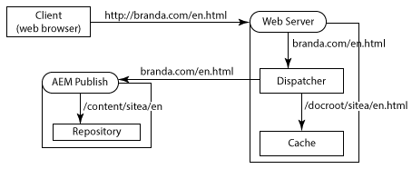
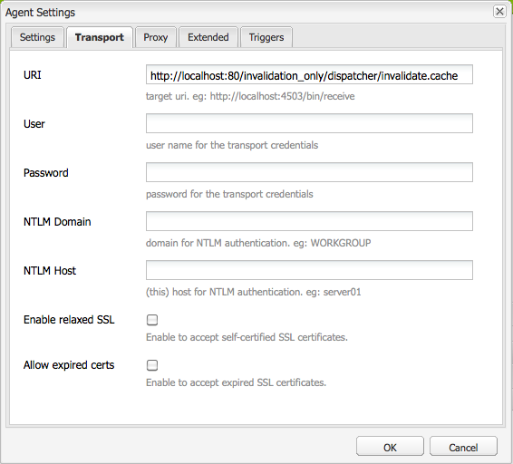
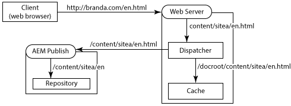
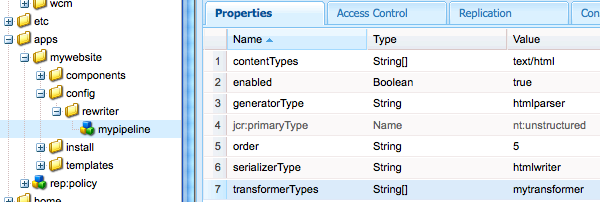

# 여러 도메인에 Dispatcher 사용 {#using-dispatcher-with-multiple-domains}

>[!NOTE]
>
>Dispatcher 버전은 AEM과 독립적입니다. AEM 또는 CQ 설명서에 임베드된 Dispatcher 설명서 링크를 따라가면 이 페이지로 리디렉션될 수 있습니다.

Dispatcher를 사용하여 다음의 조건을 지원하면서 여러 웹 도메인에서 페이지 요청을 처리합니다.

* 두 도메인의 웹 콘텐츠는 단일 AEM 저장소에 저장됩니다.
* Dispatcher 캐시의 파일은 각 도메인에 대해 별도로 무효화될 수 있습니다.

예를 들어 회사에서 브랜드 A와 브랜드 B의 두 가지 브랜드에 대한 웹 사이트를 게시할 경우, 웹 사이트 페이지의 콘텐츠는 AEM에서 작성되고 동일한 저장소 작업 영역에 저장됩니다.

```
/
| - content  
   | - sitea  
       | - content nodes  
   | - siteb  
       | - content nodes
```

`BrandA.com`의 페이지는 `/content/sitea` 아래에 저장됩니다. URL `https://BrandA.com/en.html`에 대한 클라이언트 요청은 `/content/sitea/en` 노드에 대해 렌더링된 페이지로 반환됩니다. 마찬가지로 `BrandB.com`의 페이지는 `/content/siteb` 아래에 저장됩니다.

Dispatcher를 사용하여 콘텐츠를 캐시할 때 클라이언트 HTTP 요청의 페이지 URL, 캐시에 있는 해당 파일의 경로, 저장소에 있는 해당 파일의 경로 간에 연결이 이루어져야 합니다.

## 클라이언트 요청

클라이언트가 웹 서버에 HTTP 요청을 보낼 때 요청된 페이지의 URL은 Dispatcher 캐시의 콘텐츠로(궁극적으로는 저장소의 콘텐츠로) 확인되어야 합니다.


1. 도메인 이름 시스템은 HTTP 요청에서 도메인 이름에 등록된 웹 서버의 IP 주소를 검색합니다.
1. HTTP 요청이 웹 서버로 전송됩니다.
1. HTTP 요청이 Dispatcher로 전달됩니다.
1. Dispatcher는 캐시된 파일이 유효한지 여부를 결정합니다. 유효한 경우 캐시된 파일이 클라이언트에 제공됩니다.
1. 캐시된 파일이 유효하지 않은 경우 Dispatcher는 AEM 게시 인스턴스에서 새로 렌더링된 페이지를 요청합니다.

## 캐시 무효화

Dispatcher가 캐시된 파일을 무효화하도록 Dispatcher 플러시 복제 에이전트가 요청할 때 저장소의 콘텐츠 경로는 캐시의 콘텐츠로 확인되어야 합니다.


<ol type="a">
  <li>AEM 작성자 인스턴스에서 페이지가 활성화되고 콘텐츠가 게시 인스턴스에 복제됩니다.</li>
  <li>Dispatcher 플러시 에이전트는 Dispatcher를 호출하여 복제된 콘텐츠에 대한 캐시를 무효화합니다.</li>
  <li>Dispatcher가 하나 이상의 .stat 파일을 터치하여 캐시된 파일을 무효화합니다.</li>
</ol>

여러 도메인에서 Dispatcher를 사용하려면 AEM, Dispatcher 및 웹 서버를 구성해야 합니다. 이 페이지에 설명된 솔루션은 일반적이며 대부분의 환경에 적용됩니다. 일부 AEM 토폴로지의 복잡성으로 인해 특정 문제를 해결하기 위해 솔루션에 추가 사용자 지정 구성이 필요할 수 있습니다. 기존 IT 인프라 및 관리 정책을 충족하도록 예제를 조정해야 할 수 있습니다.

## URL 매핑 {#url-mapping}

도메인 URL 및 콘텐츠 경로가 캐시된 파일로 확인되도록 하려면 프로세스의 특정 지점에서 파일 경로 또는 페이지 URL을 변환해야 합니다. 다음과 같은 일반적인 전략에 대한 설명이 제공됩니다. 여기에서는 경로 또는 URL 변환이 프로세스의 다양한 지점에서 발생합니다.

* (권장) AEM 게시 인스턴스는 리소스 확인을 위한 Sling 매핑을 사용하여 내부 URL 재작성 규칙을 구현합니다. 도메인 URL은 콘텐츠 저장소 경로로 변환됩니다. [AEM이 수신 URL 재작성](#aem-rewrites-incoming-urls)을 참조하십시오.
* 웹 서버는 도메인 URL을 캐시 경로로 변환하는 내부 URL 재작성 규칙을 사용합니다. [웹 서버가 수신 URL 재작성](#the-web-server-rewrites-incoming-urls)을 참조하십시오.

대체로 웹 페이지에 짧은 URL을 사용하는 것이 바람직합니다. 일반적으로 페이지 URL은 웹 콘텐츠가 포함된 저장소 폴더의 구조를 반영합니다. 단, URL은 최상위 저장소 노드(예: `/content`)를 표시하지 않습니다. 클라이언트가 AEM 저장소의 구조를 반드시 알고 있는 것은 아닙니다.

## 일반적인 요구 사항 {#general-requirements}

여러 도메인에서 작동하는 Dispatcher를 지원하려면 환경에서 다음 구성을 구현해야 합니다.

* 각 도메인의 콘텐츠는 저장소의 별도 분기에 있습니다(아래 예제 환경 참조).
* Dispatcher 플러시 복제 에이전트는 AEM 게시 인스턴스에 구성됩니다. ([게시 인스턴스에서 Dispatcher 캐시 무효화](page-invalidate.md)를 참조하십시오.)
* 도메인 이름 시스템은 도메인 이름을 웹 서버의 IP 주소로 확인합니다.
* Dispatcher 캐시는 AEM 콘텐츠 저장소의 디렉터리 구조를 미러링합니다. 웹 서버의 문서 루트 아래에 있는 파일 경로는 저장소에 있는 파일의 경로와 동일합니다.

## 제공된 예제를 위한 환경 {#environment-for-the-provided-examples}

제공된 예제 솔루션은 다음과 같은 특성을 가진 환경에 적용됩니다.

* AEM 작성자 및 게시 인스턴스는 Linux 시스템에 배포됩니다.
* Apache HTTPD는 Linux 시스템에 배포된 웹 서버입니다.
* AEM 콘텐츠 저장소와 웹 서버의 문서 루트는 다음 파일 구조를 사용합니다(Apache 웹 서버의 문서 루트: /`usr/lib/apache/httpd-2.4.3/htdocs)`.

   **저장소**

```
  | - /content  
    | - sitea  
  |    | - content nodes
    | - siteb  
       | - content nodes
```

**웹 서버의 문서 루트**

```
  | - /usr  
    | - lib  
      | - apache  
        | - httpd-2.4.3  
          | - htdocs  
            | - content  
              | - sitea  
                 | - content nodes 
              | - siteb  
                 | - content nodes
```

## AEM이 수신 URL 재작성 {#aem-rewrites-incoming-urls}

리소스 확인을 위한 Sling 매핑을 사용하면 수신 URL을 AEM 콘텐츠 경로와 연결할 수 있습니다. Dispatcher의 렌더링 요청이 저장소의 올바른 콘텐츠로 확인되도록 AEM 게시 인스턴스에 매핑을 만듭니다.

페이지 렌더링에 대한 Dispatcher 요청은 웹 서버에서 전달된 URL을 사용하여 페이지를 식별합니다. URL에 도메인 이름이 포함된 경우 Sling 매핑은 URL을 콘텐츠로 확인합니다. 다음 그래픽은 `/content/sitea/en` 노드에 대한 `branda.com/en.html` URL의 매핑을 보여 줍니다.



Dispatcher 캐시는 저장소 노드 구조를 미러링합니다. 따라서 페이지 활성화가 발생하면 캐시된 페이지 무효화에 대한 결과 요청에 URL 또는 경로 변환이 필요하지 않습니다.


## 웹 서버에서 가상 호스트 정의 {#define-virtual-hosts-on-the-web-server}

각 웹 도메인에 다른 문서 루트를 할당할 수 있도록 웹 서버에서 가상 호스트를 정의합니다.

* 웹 서버는 각 웹 도메인에 대한 가상 도메인을 정의해야 합니다.
* 각 도메인에 대해, 도메인의 웹 콘텐츠가 포함된 저장소의 폴더와 일치하도록 문서 루트를 구성합니다.
* 각 가상 도메인에는 [Dispatcher 설치](dispatcher-install.md) 페이지에 설명된 대로 Dispatcher 관련 구성도 포함되어야 합니다.

다음 예제 `httpd.conf` 파일은 Apache 웹 서버에 대해 두 개의 가상 도메인을 구성합니다.

* 도메인 이름과 일치하는 서버 이름은 branda.com(16행) 및 brandb.com(30행)입니다.
* 각 가상 도메인의 문서 루트는 사이트의 페이지를 포함하는 Dispatcher 캐시의 디렉터리입니다. (17행 및 31행)

이 구성에서 웹 서버는 `https://branda.com/en/products.html`에 대한 요청을 수신할 때 다음 작업을 수행합니다.

* URL을 `branda.com.` `ServerName`이 있는 가상 호스트와 연결합니다.

* URL을 Dispatcher로 전달합니다.

### httpd.conf {#httpd-conf}

```xml
# load the Dispatcher module
LoadModule dispatcher_module modules/mod_dispatcher.so
# configure the Dispatcher module
<IfModule disp_apache2.c>
 DispatcherConfig conf/dispatcher.any
 DispatcherLog    logs/dispatcher.log  
 DispatcherLogLevel 3
 DispatcherNoServerHeader 0 
 DispatcherDeclineRoot 0
 DispatcherUseProcessedURL 0
 DispatcherPassError 0
</IfModule>

# Define virtual host for brandA.com
<VirtualHost *:80>
  ServerName branda.com
  DocumentRoot /usr/lib/apache/httpd-2.4.3/htdocs/content/sitea
   <Directory /usr/lib/apache/httpd-2.4.3/htdocs/content/sitea>
     <IfModule disp_apache2.c>
       SetHandler dispatcher-handler
       ModMimeUsePathInfo On
     </IfModule>
     Options FollowSymLinks
     AllowOverride None
   </Directory>
</VirtualHost>

# define virtual host for brandB.com
<VirtualHost *:80>
  ServerName brandB.com
  DocumentRoot /usr/lib/apache/httpd-2.4.3/htdocs/content/siteb
   <Directory /usr/lib/apache/httpd-2.4.3/htdocs/content/siteb>
     <IfModule disp_apache2.c>
       SetHandler dispatcher-handler
       ModMimeUsePathInfo On
     </IfModule>
     Options FollowSymLinks
     AllowOverride None
   </Directory>
</VirtualHost>

# document root for web server
DocumentRoot "/usr/lib/apache/httpd-2.4.3/htdocs"
```

가상 호스트는 주 서버 섹션에 구성된 [DispatcherConfig](dispatcher-install.md#main-pars-67-table-7) 속성 값을 상속합니다. 가상 호스트는 자체 DispatcherConfig 속성을 포함하여 기본 서버 구성을 재정의할 수 있습니다.

### 여러 도메인을 처리하도록 Dispatcher 구성 {#configure-dispatcher-to-handle-multiple-domains}

도메인 이름과 해당 가상 호스트를 포함하는 URL을 지원하려면 다음 Dispatcher 팜을 정의하십시오.

* 각 가상 호스트를 위한 Dispatcher 팜을 구성합니다. 이러한 팜은 각 도메인에 대한 웹 서버의 요청을 처리하고 캐시된 파일을 확인하며 렌더링으로부터 페이지를 요청합니다.
* 콘텐츠가 속한 도메인에 관계없이 콘텐츠 캐시를 무효화하는 데 사용되는 Dispatcher 팜을 구성합니다. 이 팜은 플러시 Dispatcher 복제 에이전트의 파일 무효화 요청을 처리합니다.

### 가상 호스트를 위한 Dispatcher 팜 생성

클라이언트 HTTP 요청의 URL이 Dispatcher 캐시의 올바른 파일로 확인되도록 가상 호스트를 위한 팜에는 다음 구성이 있어야 합니다.

* `/virtualhosts` 속성은 도메인 이름으로 설정됩니다. 이 속성을 사용하면 Dispatcher가 팜을 도메인과 연결할 수 있습니다.
* `/filter` 속성은 도메인 이름 부분 뒤에서 잘린 요청 URL의 경로에 대한 액세스를 허용합니다. 예를 들어 `https://branda.com/en.html` URL의 경우, 경로는 `/en.html`로 해석되므로 필터는 이 경로에 대한 액세스를 허용해야 합니다.

* `/docroot` 속성은 Dispatcher 캐시에 있는 도메인 사이트 콘텐츠의 루트 디렉터리 경로로 설정됩니다. 이 경로는 원래 요청에서 연결된 URL의 접두사로 사용됩니다. 예를 들어 `/usr/lib/apache/httpd-2.4.3/htdocs/sitea`의 docroot는 `https://branda.com/en.html`에 대한 요청이 `/usr/lib/apache/httpd-2.4.3/htdocs/sitea/en.html` 파일로 확인되도록 합니다.

또한 AEM 게시 인스턴스는 가상 호스트에 대한 렌더링으로 지정되어야 합니다. 필요에 따라 다른 팜 속성을 구성합니다. 다음 코드는 branda.com 도메인에 대한 축약된 팜 구성입니다.

```xml
/farm_sitea  {     
    ...
    /virtualhosts { "branda.com" }
    /renders {
      /rend01  { /hostname "127.0.0.1"  /port "4503" }
    }
    /filter {
      /0001 { /type "deny"  /glob "*" }
      /0023 { /type "allow" /glob "*/en*" }  
      ...
     }
    /cache {
      /docroot "/usr/lib/apache/httpd-2.4.3/htdocs/content/sitea"
      ...
   }
   ...
}
```

### 캐시 무효화를 위한 Dispatcher 팜 생성

캐시된 파일 무효화 요청을 처리하려면 Dispatcher 팜이 필요합니다. 이 팜은 각 가상 호스트의 docroot 디렉터리에 있는 .stat 파일에 액세스할 수 있어야 합니다.

다음 속성 구성을 사용하면 Dispatcher가 캐시의 파일에서 AEM 콘텐츠 저장소의 파일을 확인할 수 있습니다.

* `/docroot` 속성은 웹 서버의 기본 docroot로 설정됩니다. 일반적으로 `/content` 폴더가 생성되는 디렉터리입니다. Linux에서 Apache의 예제 값 `/usr/lib/apache/httpd-2.4.3/htdocs`입니다.
* `/filter` 속성은 `/content` 디렉터리 아래의 파일에 대한 액세스를 허용합니다.

`/statfileslevel`속성은 .stat 파일이 각 가상 호스트의 루트 디렉터리에 생성될 수 있을 만큼 충분히 높아야 합니다. 이 속성을 사용하면 각 도메인의 캐시를 개별적으로 무효화할 수 있습니다. 예제 설정의 경우 `/statfileslevel` 값이 `2` 이면 `*docroot*/content/sitea` 디렉터리와 `*docroot*/content/siteb` 디렉터리에 .stat 파일을 생성합니다.

또한 게시 인스턴스는 가상 호스트에 대한 렌더링으로 지정되어야 합니다. 필요에 따라 다른 팜 속성을 구성합니다. 다음 코드는 캐시 무효화에 사용되는 팜의 축약된 구성입니다.

```xml
/farm_flush {  
    ...
    /virtualhosts   { "invalidation_only" }
    /renders  {
      /rend01  { /hostname "127.0.0.1" /port "4503" }
    }
    /filter   {
      /0001 { /type "deny"  /glob "*" }
      /0023 { /type "allow" /glob "*/content*" } 
      ...
      }
    /cache  {
       /docroot "/usr/lib/apache/httpd-2.4.3/htdocs"
       /statfileslevel "2"
       ...
   }
   ...
}
```

웹 서버를 시작하면 Dispatcher 로그(디버그 모드)에 모든 팜의 초기화가 표시됩니다.

```shell
Dispatcher initializing (build 4.1.2)
[Fri Nov 02 16:27:18 2012] [D] [24974(140006182991616)] farms[farm_sitea].cache.docroot = /usr/lib/apache/httpd-2.4.3/htdocs/content/sitea
[Fri Nov 02 16:27:18 2012] [D] [24974(140006182991616)] farms[farm_siteb].cache.docroot = /usr/lib/apache/httpd-2.4.3/htdocs/content/siteb
[Fri Nov 02 16:27:18 2012] [D] [24974(140006182991616)] farms[farm_flush].cache.docroot = /usr/lib/apache/httpd-2.4.3/htdocs
[Fri Nov 02 16:27:18 2012] [I] [24974(140006182991616)] Dispatcher initialized (build 4.1.2)
```

### 리소스 확인을 위한 Sling 매핑 구성 {#configure-sling-mapping-for-resource-resolution}

리소스 확인을 위한 Sling 매핑을 사용하여 도메인 기반 URL이 AEM 게시 인스턴스의 콘텐츠로 확인되도록 합니다. 리소스 매핑은 Dispatcher에서(원래 클라이언트 HTTP 요청에서) 들어오는 URL을 콘텐츠 노드로 변환합니다.

Sling 리소스 매핑에 대한 자세한 내용은 Sling 설명서의 [리소스 해결을 위한 매핑](https://sling.apache.org/site/mappings-for-resource-resolution.html)을 참조하십시오.

추가 매핑이 필요할 수 있지만 일반적으로 다음 리소스에 매핑이 필요합니다.

* 콘텐츠 페이지의 루트 노드(`/content`아래)
* 페이지가 사용하는 디자인 노드(`/etc/designs`아래)
* `/libs` 폴더

콘텐츠 페이지에 대한 매핑을 생성한 후 필요한 추가 매핑을 검색하려면 웹 브라우저를 사용하여 웹 서버에서 페이지를 엽니다. 게시 인스턴스의 error.log 파일에서 찾을 수 없는 리소스에 대한 메시지를 찾으십시오. 다음 예제 메시지는 `/etc/clientlibs`에 대한 매핑이 필요함을 나타냅니다.

```shell
01.11.2012 15:59:24.601 *INFO* [10.36.34.243 [1351799964599] GET /etc/clientlibs/foundation/jquery.js HTTP/1.1] org.apache.sling.engine.impl.SlingRequestProcessorImpl service: Resource /content/sitea/etc/clientlibs/foundation/jquery.js not found
```

>[!NOTE]
>
>기본 Apache Sling 재작성기의 linkchecker 변환기는 끊어진 링크를 방지하기 위해 페이지의 하이퍼링크를 자동으로 수정합니다. 단, 링크 재작성은 링크 대상이 HTML 또는 HTM 파일인 경우에만 수행됩니다. 다른 파일 유형에 대한 링크를 업데이트하려면 변환기 구성 요소를 만들고 HTML 재작성기 파이프라인에 추가합니다.

### 예제 리소스 매핑 노드

다음 표에는 branda.com 도메인에 대한 리소스 매핑을 구현하는 노드가 나열되어 있습니다. `brandb.com` 도메인에 대해 유사한 노드가 생성됩니다(예: `/etc/map/http/brandb.com`). 페이지 HTML의 참조가 Sling의 컨텍스트에서 올바르게 해석되지 않을 때 모든 경우에 매핑이 필요합니다.

| 노드 경로 | 유형 | 속성 |
|--- |--- |--- |
| `/etc/map/http/branda.com` | sling:매핑 | 이름: sling:internalRedirect 유형: 문자열 값: /content/sitea |
| `/etc/map/http/branda.com/libs` | sling:매핑 | 이름: sling:internalRedirect <br/>유형: 문자열 <br/>값: /libs |
| `/etc/map/http/branda.com/etc` | sling:매핑 |  |
| `/etc/map/http/branda.com/etc/designs` | sling:매핑 | 이름: sling:internalRedirect <br/>유형: 문자열 <br/>값: /etc/designs |
| `/etc/map/http/branda.com/etc/clientlibs` | sling:매핑 | 이름: sling:internalRedirect <br/>유형: 문자열 <br/>값: /etc/clientlibs |

## Dispatcher 플러시 복제 에이전트 구성 {#configuring-the-dispatcher-flush-replication-agent}

AEM 게시 인스턴스의 Dispatcher 플러시 복제 에이전트는 올바른 Dispatcher 팜에 무효화 요청을 보내야 합니다. 팜을 대상으로 지정하려면 전송 탭에서 Dispatcher 플러시 복제 에이전트의 URI 속성을 사용합니다. 캐시를 무효화하도록 구성된 Dispatcher 팜의 `/virtualhost` 속성 값을 포함합니다.

`https://*webserver_name*:*port*/*virtual_host*/dispatcher/invalidate.cache`

예를 들어 이전 예제의 `farm_flush` 팜을 사용하려면 URI는 `https://localhost:80/invalidation_only/dispatcher/invalidate.cache`입니다.



## 웹 서버가 수신 URL 재작성 {#the-web-server-rewrites-incoming-urls}

웹 서버의 내부 URL 재작성 기능을 사용하여 도메인 기반 URL을 Dispatcher 캐시의 파일 경로로 변환합니다. 예를 들어 `https://brandA.com/en.html` 페이지에 대한 클라이언트 요청은 웹 서버의 문서 루트에 있는 `content/sitea/en.html`파일로 변환됩니다.



Dispatcher 캐시는 저장소 노드 구조를 미러링합니다. 따라서 페이지 활성화가 발생하면 캐시된 페이지를 무효화하기 위한 결과 요청에 URL 또는 경로 변환이 필요하지 않습니다.


## 웹 서버에서 가상 호스트 및 재작성 규칙 정의 {#define-virtual-hosts-and-rewrite-rules-on-the-web-server}

웹 서버에서 다음 측면을 구성합니다.

* 각 웹 도메인에 대한 가상 호스트를 정의합니다.
* 각 도메인에 대해, 도메인의 웹 콘텐츠가 포함된 저장소의 폴더와 일치하도록 문서 루트를 구성합니다.
* 각 가상 도메인에 대해, 수신 URL을 캐시된 파일의 경로로 변환하는 URL 이름 바꾸기 규칙을 만듭니다.
* 각 가상 도메인에는 [Dispatcher 설치](dispatcher-install.md) 페이지에 설명된 대로 Dispatcher 관련 구성도 포함되어야 합니다.
* 웹 서버가 재작성한 URL을 사용하도록 Dispatcher 모듈을 구성해야 합니다. ([Dispatcher 설치](dispatcher-install.md)의 `DispatcherUseProcessedURL` 속성을 참조하십시오.)

다음 예제 httpd.conf 파일은 Apache 웹 서버에 대해 두 개의 가상 호스트를 구성합니다.

* 도메인 이름과 일치하는 서버 이름은 `brandA.com` (16행) 및 `brandB.com` (32행)입니다.

* 각 가상 도메인의 문서 루트는 사이트의 페이지를 포함하는 Dispatcher 캐시의 디렉터리입니다. (20행 및 33행)
* 각 가상 도메인에 대한 URL 재작성 규칙은 요청된 페이지의 경로 앞에 캐시의 페이지 경로를 붙이는 정규 표현식입니다. (19행 및 35행)
* `DispatherUseProcessedURL` 속성은 `1`로 설정됩니다. (10행)

예를 들어 웹 서버는 `https://brandA.com/en/products.html` URL이 포함된 요청을 수신할 때 다음 작업을 수행합니다.

* URL을 `brandA.com.` `ServerName`이 있는 가상 호스트와 연결합니다.
* URL을 `/content/sitea/en/products.html.`로 재작성합니다.
* URL을 Dispatcher로 전달합니다.

### httpd.conf {#httpd-conf-1}

```xml
# load the Dispatcher module
LoadModule dispatcher_module modules/mod_dispatcher.so
# configure the Dispatcher module
<IfModule disp_apache2.c>
 DispatcherConfig conf/dispatcher.any
 DispatcherLog    logs/dispatcher.log  
 DispatcherLogLevel 3
 DispatcherNoServerHeader 0 
 DispatcherDeclineRoot 0
 DispatcherUseProcessedURL 1
 DispatcherPassError 0
</IfModule>

# Define virtual host for brandA.com
<VirtualHost *:80>
  ServerName branda.com
  DocumentRoot /usr/lib/apache/httpd-2.4.3/htdocs/content/sitea
  RewriteEngine  on
  RewriteRule    ^/(.*)\.html$  /content/sitea/$1.html [PT]
   <Directory /usr/lib/apache/httpd-2.4.3/htdocs/content/sitea>
     <IfModule disp_apache2.c>
       SetHandler dispatcher-handler
       ModMimeUsePathInfo On
     </IfModule>
     Options FollowSymLinks
     AllowOverride None
   </Directory>
</VirtualHost>

# define virtual host for brandB.com
<VirtualHost *:80>
  ServerName brandB.com
  DocumentRoot /usr/lib/apache/httpd-2.4.3/htdocs/content/siteb
  RewriteEngine  on
  RewriteRule    ^/(.*)\.html$  /content/siteb/$1.html [PT]
   <Directory /usr/lib/apache/httpd-2.4.3/htdocs/content/siteb>
     <IfModule disp_apache2.c>
       SetHandler dispatcher-handler
       ModMimeUsePathInfo On
     </IfModule>
     Options FollowSymLinks
     AllowOverride None
   </Directory>
</VirtualHost>

# document root for web server
DocumentRoot "/usr/lib/apache/httpd-2.4.3/htdocs"
```

### Dispatcher 팜 구성 {#configure-a-dispatcher-farm}

웹 서버가 URL을 재작성할 때 Dispatcher는 [Dispatcher 구성](dispatcher-configuration.md)에 따라 정의된 단일 팜이 필요합니다. 웹 서버 가상 호스트 및 URL 이름 바꾸기 규칙을 지원하려면 다음 구성이 필요합니다.

* `/virtualhosts` 속성은 모든 VirtualHost 정의에 대한 ServerName 값을 포함해야 합니다.
* The `/statfileslevel` 속성은 각 도메인의 콘텐츠 파일이 포함된 디렉터리에 .stat 파일을 생성할 수 있을 만큼 높아야 합니다.

다음 예제 구성 파일은 Dispatcher와 함께 설치된 예제 `dispatcher.any` 파일을 기반으로 합니다. 이전 `httpd.conf` 파일의 웹 서버 구성을 지원하려면 다음 변경이 필요합니다.

* `/virtualhosts` 속성은 Dispatcher가 `brandA.com` 및 `brandB.com` 도메인에 대한 요청을 처리하도록 합니다. (12행)
* `/statfileslevel` 속성은 2로 설정되어, 도메인의 웹 콘텐츠(41행)가 포함된 각 디렉터리에 .stat 파일이 생성됩니다. `/statfileslevel "2"`

평소와 같이, 캐시의 문서 루트는 웹 서버의 문서 루트(40행)와 동일합니다. `/usr/lib/apache/httpd-2.4.3/htdocs`

### `dispatcher.any` {#dispatcher-any}

```xml
/name "testDispatcher"
/farms
  {
  /dispfarm0
    {  
    /clientheaders
      {
      "*"
      }      
    /virtualhosts
      {
      "brandA.com" "brandB.com"
      }
    /renders
      {
      /rend01    {  /hostname "127.0.0.1"   /port "4503"  }
      }
    /filter
      {
      /0001 { /type "deny"  /glob "*" }
      /0023 { /type "allow" /glob "*/content*" }  # disable this rule to allow mapped content only
      /0041 { /type "allow" /glob "* *.css *"   }  # enable css
      /0042 { /type "allow" /glob "* *.gif *"   }  # enable gifs
      /0043 { /type "allow" /glob "* *.ico *"   }  # enable icos
      /0044 { /type "allow" /glob "* *.js *"    }  # enable javascript
      /0045 { /type "allow" /glob "* *.png *"   }  # enable png
      /0046 { /type "allow" /glob "* *.swf *"   }  # enable flash
      /0061 { /type "allow" /glob "POST /content/[.]*.form.html" }  # allow POSTs to form selectors under content
      /0062 { /type "allow" /glob "* /libs/cq/personalization/*"  }  # enable personalization
      /0081 { /type "deny"  /glob "GET *.infinity.json*" }
      /0082 { /type "deny"  /glob "GET *.tidy.json*"     }
      /0083 { /type "deny"  /glob "GET *.sysview.xml*"   }
      /0084 { /type "deny"  /glob "GET *.docview.json*"  }
      /0085 { /type "deny"  /glob "GET *.docview.xml*"  }      
      /0086 { /type "deny"  /glob "GET *.*[0-9].json*" }
      /0090 { /type "deny"  /glob "* *.query.json*" }
      }
    /cache
      {
      /docroot "/usr/lib/apache/httpd-2.4.3/htdocs"
      /statfileslevel "2"
      /allowAuthorized "0"
      /rules
        {
        /0000  { /glob "*"     /type "allow"  }
        }
      /invalidate
        {
        /0000  {   /glob "*" /type "deny"  }
        /0001 {  /glob "*.html" /type "allow"  }
        }
      /allowedClients
        {
        }     
      }
    /statistics
      {
      /categories
        {
        /html  { /glob "*.html" }
        /others  {  /glob "*"  }
        }
      }
    }
  }
```

>[!NOTE]
>
>단일 Dispatcher 팜이 정의되어 있으므로 AEM 게시 인스턴스의 Dispatcher 플러시 복제 에이전트에는 특별한 구성이 필요하지 않습니다.

## 비 HTML 파일에 대한 링크 재작성 {#rewriting-links-to-non-html-files}

확장명이 .html 또는 .htm이 아닌 파일에 대한 참조를 재작성하려면 Sling 재작성기 변환기 구성 요소를 생성하고 기본 재작성기 파이프라인에 추가합니다.

리소스 경로가 웹 서버 컨텍스트에서 올바르게 확인되지 않는 경우 참조를 재작성합니다. 예를 들어 이미지 생성 구성 요소가 /content/sitea/en/products.navimage.png와 같은 링크를 만들 때 변환기가 필요합니다. [완벽한 기능을 갖춘 인터넷 웹 사이트를 만드는 방법](https://helpx.adobe.com/kr/experience-manager/6-5/sites/developing/using/the-basics.html)의 topnav 구성 요소는 이러한 링크를 만듭니다.

[Sling 재작성기](https://sling.apache.org/documentation/bundles/output-rewriting-pipelines-org-apache-sling-rewriter.html)는 Sling 출력을 후처리하는 모듈입니다. 재작성기의 SAX 파이프라인 구현은 생성기, 하나 이상의 변환기 및 직렬 변환기로 구성됩니다.

* **생성기:** Sling 출력 스트림(HTML 문서)을 구문 분석하고 특정 요소 유형이 발생하면 SAX 이벤트를 생성합니다.
* **변환기:** SAX 이벤트를 수신하고 결과적으로 이벤트 대상(HTML 요소)을 수정합니다. 재작성기 파이프라인에는 0개 이상의 변환기가 포함되어 있습니다. 변환기는 순서대로 실행되어 SAX 이벤트를 순서의 다음 변환기로 전달합니다.
* **직렬 변환기:** 각 변환기의 수정 사항을 포함하여 출력을 직렬화합니다.


### AEM 기본 Rewriter 파이프라인 {#the-aem-default-rewriter-pipeline}

AEM은 text/html 유형의 문서를 처리하는 기본 파이프라인 재작성기를 사용합니다.

* 생성기는 HTML 문서를 구문 분석하고 a, img, area, form, base, link, script 및 body 요소가 발생하면 SAX 이벤트를 생성합니다. 생성기 별칭은 `htmlparser`입니다.
* 파이프라인에는 다음과 같은 변환기가 포함됩니다. `linkchecker`, `mobile`, `mobiledebug`, `contentsync`. `linkchecker` 변환기는 참조된 HTML 또는 HTM 파일에 대한 경로를 외부화하여 링크가 끊어지는 것을 방지합니다.
* 직렬 변환기는 HTML 출력을 작성합니다. 직렬 변환기 별칭은 htmlwriter입니다.

`/libs/cq/config/rewriter/default` 노드는 파이프라인을 정의합니다.

### 변환기 생성 {#creating-a-transformer}

다음 작업을 수행하여 변환기 구성 요소를 생성하고 파이프라인에서 사용합니다.

1. `org.apache.sling.rewriter.TransformerFactory` 인터페이스를 구현합니다. 이 클래스는 변환기 클래스의 인스턴스를 생성합니다. `transformer.type` 특성(변환기 별칭)에 대한 값을 지정하고 클래스를 OSGi 서비스 구성 요소로 구성합니다.
1. `org.apache.sling.rewriter.Transformer` 인터페이스를 구현합니다. 작업을 최소화하기 위해 `org.apache.cocoon.xml.sax.AbstractSAXPipe` 클래스를 확장할 수 있습니다. startElement 메서드를 재정의하여 재작성 동작을 사용자 지정합니다. 이 메서드는 변환기에 전달되는 모든 SAX 이벤트에 대해 호출됩니다.
1. 클래스를 번들에 추가하고 배포합니다.
1. AEM 애플리케이션에 구성 노드를 추가하여 파이프라인에 변환기를 추가합니다.

>[!TIP]
>대신 정의된 모든 재작성기에 변환기가 삽입되도록 TransformerFactory를 구성할 수 있습니다. 따라서 파이프라인을 구성할 필요가 없습니다.
>
>* `pipeline.mode` 속성을 `global`로 설정하십시오.
>* `service.ranking` 속성을 양의 정수로 설정하십시오.
>* `pipeline.type` 속성을 포함하지 마십시오.


>[!NOTE]
>
>Content Package Maven Plugin의 [multimodule](https://helpx.adobe.com/kr/experience-manager/aem-previous-versions.html) 원형을 사용하여 Maven 프로젝트를 생성합니다. POM은 자동으로 콘텐츠 패키지를 만들고 설치합니다.

다음 예제에서는 이미지 파일에 대한 참조를 재작성하는 변환기를 구현합니다.

* MyRewriterTransformerFactory 클래스는 MyRewriterTransformer 개체를 인스턴스화합니다. pipeline.type 속성은 변환기 별칭을 mytransformer로 설정합니다. 파이프라인에 별칭을 포함하기 위해 파이프라인 구성 노드는 변환기 목록에 이 별칭을 포함합니다.
* MyRewriterTransformer 클래스는 AbstractSAXTransformer 클래스의 startElement 메서드를 재정의합니다. startElement 메서드는 img 요소에 대한 src 속성 값을 재작성합니다.

예제는 강력하지 않으므로 프로덕션 환경에서 사용하면 안 됩니다.

### 예제 TransformerFactory 구현 {#example-transformerfactory-implementation}

```java
package com.adobe.example;

import org.apache.felix.scr.annotations.Component;
import org.apache.felix.scr.annotations.Service;
import org.apache.felix.scr.annotations.Property;

import org.apache.sling.rewriter.Transformer;
import org.apache.sling.rewriter.TransformerFactory;

@Component
@Service
public class MyRewriterTransformerFactory implements TransformerFactory {
    /* Define the alias */
    @Property(value="mytransformer")
    static final String PIPELINE_TYPE ="pipeline.type";
 
    public Transformer createTransformer() {
        
        return new MyRewriterTransformer ();
    }
}
```

### 예제 변환기 구현 {#example-transformer-implementation}

```java
package com.adobe.example;

import java.io.IOException;

import org.apache.cocoon.xml.sax.AbstractSAXPipe;

import org.apache.sling.api.SlingHttpServletRequest;
import org.apache.sling.rewriter.ProcessingComponentConfiguration;
import org.apache.sling.rewriter.ProcessingContext;
import org.apache.sling.rewriter.Transformer;

import org.slf4j.Logger;
import org.slf4j.LoggerFactory;

import org.xml.sax.Attributes;
import org.xml.sax.SAXException;
import org.xml.sax.helpers.AttributesImpl;

import javax.servlet.http.HttpServletRequest;

public class MyRewriterTransformer extends AbstractSAXPipe implements Transformer {

 private static final Logger log = LoggerFactory.getLogger(MyRewriterTransformer.class);
 private SlingHttpServletRequest httpRequest; 
 /* The element and attribute to act on  */
 private static final String ATT_NAME = new String("src");
 private static final String EL_NAME = new String("img");

 public MyRewriterTransformer () {
 }
 public void dispose() {
 }
 public void init(ProcessingContext context, ProcessingComponentConfiguration config) throws IOException {
  this.httpRequest = context.getRequest();
  log.debug("Transforming request {}.", httpRequest.getRequestURI());
 }
 @Override
 public void startElement (String nsUri, String localname, String qname, Attributes atts) throws SAXException {
  /* copy the element attributes */
  AttributesImpl linkAtts = new AttributesImpl(atts); 
  /* Only interested in EL_NAME elements */
  if(EL_NAME.equalsIgnoreCase(localname)){

   /* iterate through the attributes of the element and act only on ATT_NAME attributes */
   for (int i=0; i < linkAtts.getLength(); i++) {
    if (ATT_NAME.equalsIgnoreCase(linkAtts.getLocalName(i))) {
     String path_in_link = linkAtts.getValue(i);

     /* use the resource resolver of the http request to reverse-resolve the path  */
     String mappedPath = httpRequest.getResourceResolver().map(httpRequest, path_in_link);

     log.info("Tranformed {} to {}.", path_in_link,mappedPath);

     /* update the attribute value */
     linkAtts.setValue(i,mappedPath);
    }
   }

  }
        /* return updated attributes to super and continue with the transformer chain */
 super.startElement(nsUri, localname, qname, linkAtts);
 }
}
```

### 재작성기 파이프라인에 변환기 추가 {#adding-the-transformer-to-a-rewriter-pipeline}

변환기를 사용하는 파이프라인을 정의하는 JCR 노드를 만듭니다. 다음 노드 정의는 텍스트/html 파일을 처리하는 파이프라인을 생성합니다. HTML용 기본 AEM 생성기 및 파서가 사용됩니다.

>[!NOTE]
>
>변환기 속성 `pipeline.mode`를 `global`로 설정하면 파이프라인을 구성할 필요가 없습니다. `global` 모드는 변환기를 모든 파이프라인에 삽입합니다.

### 재작성기 구성 노드 - XML 표현 {#rewriter-configuration-node-xml-representation}

```xml
<?xml version="1.0" encoding="UTF-8"?>
<jcr:root xmlns:jcr="https://www.jcp.org/jcr/1.0" xmlns:nt="https://www.jcp.org/jcr/nt/1.0"
    jcr:primaryType="nt:unstructured"
    contentTypes="[text/html]"
    enabled="{Boolean}true"
    generatorType="htmlparser"
    order="5"
    serializerType="htmlwriter"
    transformerTypes="[mytransformer]">
</jcr:root>
```

다음 그래픽은 노드의 CRXDE Lite 표현을 보여 줍니다.


