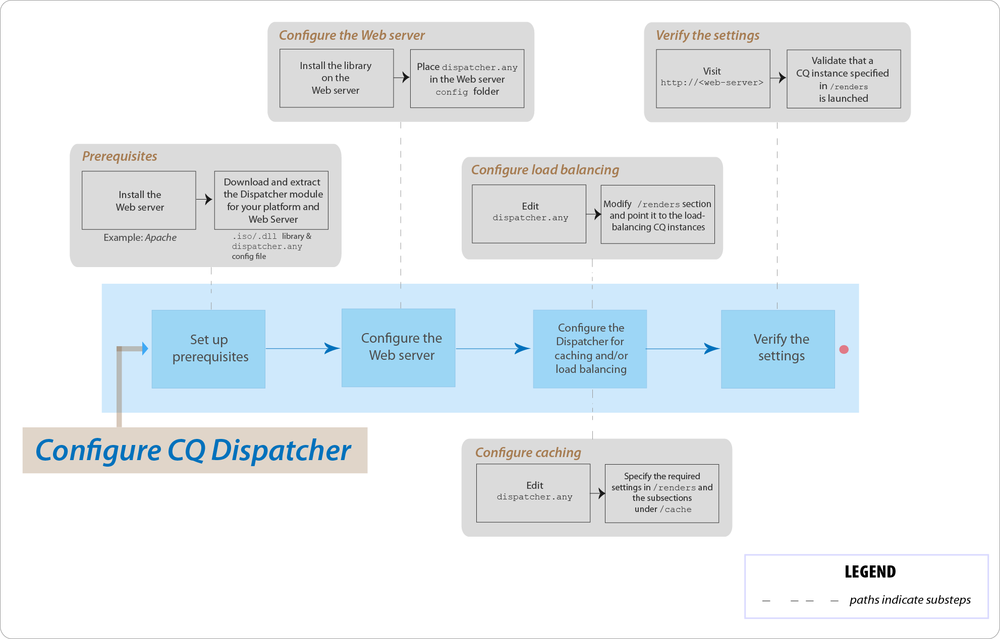

# AEM Dispatcher 주요 문제 FAQ



## 소개

### Dispatcher란 무엇입니까?

Dispatcher는 빠르고 동적인 웹 작성 환경을 구현하는 데 도움이 되는 Adobe Experience Manager의 캐싱 및/또는 로드 밸런싱 도구입니다. 캐싱의 경우 Dispatcher는 Apache와 같은 HTTP 서버의 일부로 작동합니다. 정적 웹 사이트 콘텐츠를 가능한 한 많이 저장(또는 &quot;캐싱&quot;)하고 웹 사이트의 레이아웃 엔진에 가끔 액세스하는 것을 목표로 합니다. 로드 밸런싱 역할에서 Dispatcher는 다양한 AEM 인스턴스(renders)에 사용자 요청(로드)을 배포합니다.

캐싱을 위해 Dispatcher 모듈은 정적 콘텐츠를 제공하는 웹 서버의 기능을 사용합니다. Dispatcher는 캐시된 문서를 웹 서버의 문서 루트에 배치합니다.

### Dispatcher는 캐싱을 어떻게 수행합니까?

Dispatcher는 정적 콘텐츠를 제공하는 웹 서버의 기능을 사용합니다. Dispatcher는 캐시된 문서를 웹 서버의 문서 루트에 저장합니다. Dispatcher에는 웹 사이트를 변경할 때 캐시 콘텐츠를 업데이트하는 두 가지 기본 방법이 있습니다.

* **콘텐츠 업데이트** 변경된 페이지와 직접 연결된 파일을 제거합니다.
* **자동 무효화**&#x200B;는 업데이트 후 오래된 캐시 부분을 자동으로 무효화합니다. 예를 들어 아무것도 삭제하지 않고 효과적으로 관련 페이지에 최신 상태가 아님 플래그를 지정합니다.

### 로드 밸런싱의 이점은 무엇입니까?

로드 밸런싱은 여러 AEM 인스턴스에 사용자 요청(로드)을 분배합니다. 다음 목록에서는 로드 밸런싱의 이점을 설명합니다.

* **향상된 처리 능력**: 실제로 이 방법은 Dispatcher가 여러 AEM 인스턴스 간에 문서 요청을 공유함을 의미합니다. 각 인스턴스에는 처리할 문서가 적기 때문에 응답 시간이 더 빨라집니다. Dispatcher는 각 문서 범주에 대한 내부 통계를 유지하므로 로드를 예측하고 쿼리를 효율적으로 배포할 수 있습니다.
* **실패 시 보장 서비스 증가**: Dispatcher가 인스턴스에서 응답을 받지 않으면 요청을 자동으로 다른 인스턴스 중 하나로 전달합니다. 따라서 인스턴스를 사용할 수 없게 되면 그 유일한 효과는 계산 능력이 손실되는 정도에 비례한 사이트의 둔화입니다.

>[!NOTE]
>
>자세한 내용은 [Dispatcher 개요 페이지](dispatcher.md)를 참조하십시오.

## 설정 및 구성

### Dispatcher 모듈은 어디에서 다운로드합니까?

[Dispatcher 릴리스 정보](release-notes.md) 페이지에서 최신 Dispatcher 모듈을 다운로드할 수 있습니다.

### Dispatcher 모듈은 어떻게 설치합니까?

[Dispatcher 설치](dispatcher-install.md) 페이지를 참조하십시오.

### Dispatcher 모듈은 어떻게 구성합니까?

[Dispatcher 구성](dispatcher-configuration.md) 페이지를 참조하십시오.

### 작성자 인스턴스를 위한 Dispatcher를 어떻게 구성합니까?

자세한 단계는 [작성자의 인스턴스로 Dispatcher 사용](dispatcher.md#using-a-dispatcher-with-an-author-server)을 참조하십시오.

### 여러 도메인으로 Dispatcher를 구성하려면 어떻게 해야 합니까?

도메인이 다음 조건을 충족하는 경우 여러 도메인으로 CQ 디스패처를 구성할 수 있습니다.

* 두 도메인의 웹 콘텐츠는 단일 AEM 저장소에 저장됩니다.
* Dispatcher 캐시의 파일은 각 도메인에 대해 별도로 무효화될 수 있습니다.

자세한 내용은 [여러 도메인에 Dispatcher 사용](dispatcher-domains.md)을 참조하십시오.

### 사용자의 모든 요청이 동일한 게시 인스턴스로 라우팅되도록 Dispatcher를 구성하려면 어떻게 해야 합니까?

[고정 연결](dispatcher-configuration.md#identifying-a-sticky-connection-folder-stickyconnectionsfor) 기능을 사용하여 사용자의 모든 문서가 동일한 AEM 인스턴스에서 처리되도록 할 수 있습니다. 이 기능은 개인화된 페이지 및 세션 데이터를 사용하는 경우 중요합니다. 데이터는 인스턴스에 저장됩니다. 따라서 동일한 사용자의 후속 요청은 해당 인스턴스로 반환해야 하며 그렇지 않으면 데이터가 손실됩니다.

고정 연결은 요청을 최적화하는 Dispatcher의 기능을 제한하므로 필요한 경우에만 이 접근 방식을 사용해야 합니다. “고정” 문서를 포함하는 폴더를 지정할 수 있으므로 해당 폴더의 모든 문서가 사용자를 위해 동일한 인스턴스에서 처리되도록 할 수 있습니다.

### 고정 연결과 캐싱을 함께 사용할 수 있습니까?

고정 연결을 사용하는 대부분의 페이지에서는 캐싱을 꺼야 합니다. 그렇지 않으면 세션 콘텐츠에 관계없이 페이지의 동일한 인스턴스가 모든 사용자에게 표시됩니다.

일부 애플리케이션의 경우 고정 연결과 캐싱을 모두 사용할 수 있습니다. 예를 들어 세션에 데이터를 쓰는 양식을 표시하는 경우 고정 연결과 캐싱을 동시에 사용할 수 있습니다.

### Dispatcher와 AEM 게시 인스턴스가 동일한 물리적 시스템에 상주할 수 있습니까?

예, 시스템이 충분히 강력하다면 가능합니다. 단, Dispatcher와 AEM 게시 인스턴스를 다른 시스템에 설정하는 것이 좋습니다.

일반적으로 게시 인스턴스는 방화벽 내부에 있고 Dispatcher는 DMZ에 있습니다. 동일한 물리적 시스템에 게시 인스턴스와 Dispatcher를 모두 사용하기로 결정한 경우 방화벽 설정이 외부 네트워크에서 게시 인스턴스에 대한 직접 액세스를 금지하는지 확인하십시오.

### 특정 확장명을 가진 파일만 캐시할 수 있습니까?

예. 예를 들어 GIF 파일만 캐시하려면 dispatcher.any 구성 파일의 캐시 섹션에 *.gif를 지정합니다.

### 캐시에서 어떻게 파일을 삭제합니까?

HTTP 요청을 사용하여 캐시에서 파일을 삭제할 수 있습니다. HTTP 요청이 수신되면 Dispatcher가 캐시에서 파일을 삭제합니다. Dispatcher는 페이지에 대한 클라이언트 요청을 수신할 때만 파일을 다시 캐시합니다. 캐시된 파일을 이러한 방식으로 삭제하는 것은 동일한 페이지에 대한 동시 요청을 수신할 가능성이 없는 웹 사이트에 적합합니다.

HTTP 요청의 구문은 다음과 같습니다.

```
POST /dispatcher/invalidate.cache HTTP/1.1
CQ-Action: Activate
CQ-Handle: path-pattern
Content-Length: 0
```

Dispatcher는 CQ-Handle 헤더 값과 이름이 일치하는 캐시된 파일 및 폴더를 삭제합니다. 예를 들어 `/content/geomtrixx-outdoors/en`의 CQ-Handle은 다음 항목과 일치합니다.

geometrixx-outdoors 디렉토리에 있는 모든 파일(파일 확장명 중 하나)입니다. 이름이 지정된 모든 디렉토리 `_jcr_content` en 디렉토리 아래(있는 경우 페이지의 하위 노드의 캐시된 렌더링을 포함합니다).
디렉토리 `en` 는 `CQ-Action` is `Delete` 또는 `Deactivate`.

이 토픽에 대한 자세한 내용은 [수동으로 Dispatcher 캐시 무효화](page-invalidate.md)를 참조하십시오.

### How do I implement permission-sensitive caching?

[보안 콘텐츠 캐싱](permissions-cache.md) 페이지를 참조하십시오.

### Dispatcher와 CQ 인스턴스 간의 통신을 보호하려면 어떻게 해야 합니까?

[Dispatcher 보안 점검 목록](security-checklist.md) 및 [AEM 보안 점검 목록](https://experienceleague.adobe.com/docs/experience-manager-64/administering/security/security-checklist.html?lang=en) 페이지를 참조하십시오.

### Dispatcher 문제 `jcr:content`가 `jcr%3acontent`로 변경됨

**질문**: 최근 Dispatcher 수준에서 문제가 발생했습니다. CQ 저장소에서 일부 데이터를 가져온 AJAX 호출 중 하나 `jcr:content` 안에 있습니다. 그건.. `jcr%3acontent` 결과: 잘못된 결과 집합입니다.

**답변**: 사용 `ResourceResolver.map()` 사용/발급된 get 요청을 받는 &#39;친숙한&#39; URL을 가져오는 방법과 Dispatcher로 캐싱 문제를 해결하는 방법도 있습니다. map() 메서드는 `:` 콜론을 밑줄로 설정하고 resolve() 메서드는 다시 SLING JCR 읽기 가능한 형식으로 디코딩합니다. map() 메서드를 사용하여 Ajax 호출에 사용되는 URL을 생성합니다.

추가 참조: [https://sling.apache.org/documentation/the-sling-engine/mappings-for-resource-resolution.html#namespace-mangling](https://sling.apache.org/documentation/the-sling-engine/mappings-for-resource-resolution.html#namespace-mangling)

## Dispatcher 플러시

### 게시 인스턴스에서 Dispatcher 플러시 에이전트를 어떻게 구성합니까?

[복제](https://experienceleague.adobe.com/docs/experience-manager-64/deploying/configuring/replication.html?lang=en#configuring-your-replication-agents) 페이지를 참조하십시오.

### Dispatcher 플러싱 문제는 어떻게 해결합니까?

[다음 문제 해결 문서를 참조하십시오](https://experienceleague.adobe.com/search.html?lang=en#q=troubleshooting%20dispatcher%20flushing%20issues&amp;sort=relevancy&amp;f:el_product=[Experience%20Manager]).

삭제 작업으로 인해 Dispatcher가 플러시되는 경우 [Sensei Martin의 이 커뮤니티 블로그 게시물에 있는 해결 방법을 사용하십시오](https://mkalugin-cq.blogspot.com/2012/04/i-have-been-working-on-following.html).

### Dispatcher 캐시에서 DAM 에셋을 플러시하는 방법은 무엇입니까?

“체인 복제” 기능을 사용할 수 있습니다.  이 기능이 활성화되면 작성자로부터 복제가 수신되면 Dispatcher 초기화 에이전트가 플러시 요청을 전송합니다.

활성화하려면

1. 게시에서 플러싱 에이전트를 만들려면 [여기의 단계를 따르십시오](page-invalidate.md#invalidating-dispatcher-cache-from-a-publishing-instance).
1. 각 에이전트의 구성과 **Triggers** 탭에서 다음을 확인합니다 **수신 시** 상자.

## 기타

Dispatcher는 문서가 최신 상태인지 어떻게 확인합니까?
문서가 최신 상태인지 확인하기 위해 Dispatcher는 다음 작업을 수행합니다.

문서가 자동 무효화 대상인지 여부를 확인합니다. 그렇지 않으면 문서가 최신 문서로 간주됩니다.
문서가 자동 무효화되도록 구성된 경우 Dispatcher는 사용 가능한 마지막 변경 내용보다 오래되었는지 여부를 확인합니다. 이전 버전인 경우 Dispatcher는 AEM 인스턴스에서 현재 버전을 요청하고 캐시에 있는 버전을 대체합니다.

### Dispatcher는 문서를 어떻게 반환합니까?

[Dispatcher 구성](dispatcher-configuration.md) 파일, `dispatcher.any`을 사용하여 Dispatcher가 문서를 캐시할지 여부를 정의할 수 있습니다. Dispatcher는 캐시 가능한 문서 목록에 대해 요청을 확인합니다. 문서가 이 목록에 없으면 Dispatcher가 AEM 인스턴스에서 문서를 요청합니다.

`/rules` 속성은 문서 경로에 따라 캐시되는 문서를 제어합니다. `/rules` 속성에 관계없이 Dispatcher는 다음과 같은 상황에서 문서를 캐시하지 않습니다.

* 요청 URI에 `(?)` 물음표.
* 캐시할 필요가 없는 검색 결과와 같은 동적 페이지를 나타냅니다.
* 파일 확장명이 없습니다.
* 웹 서버에는 문서 유형(MIME 유형)을 결정하기 위한 확장명이 필요합니다.
* 인증 헤더가 설정되어 있습니다(구성 가능).
* AEM 인스턴스가 다음 헤더로 응답하는 경우:
   * no-cache
   * no-store
   * must-revalidate

Dispatcher는 정적 웹 사이트의 일부인 것처럼 캐시된 파일을 웹 서버에 저장합니다. 사용자가 캐시된 문서를 요청하는 경우 Dispatcher는 해당 문서가 웹 서버의 파일 시스템에 존재하는지 여부를 확인합니다. 존재한다면 Dispatcher는 문서를 반환합니다. 존재하지 않는다면 Dispatcher는 AEM 인스턴스로부터 문서를 요청합니다.

>[!NOTE]
>
>GET 또는 HEAD(HTTP 헤더의 경우) 메서드는 Dispatcher에서 캐시할 수 있습니다. 응답 헤더 캐싱에 대한 추가 정보는 [HTTP 응답 헤더 캐싱](dispatcher-configuration.md#caching-http-response-headers) 섹션을 참조하십시오.

### 설정에서 여러 Dispatcher를 구현할 수 있습니까?

예. 이러한 경우 두 Dispatchers가 모두 AEM 웹 사이트에 직접 액세스할 수 있어야 합니다. Dispatcher는 또 다른 Dispatcher에서 오는 요청을 처리할 수 없습니다.
