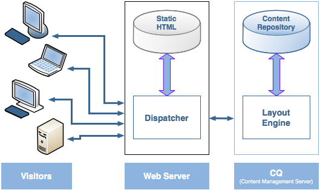
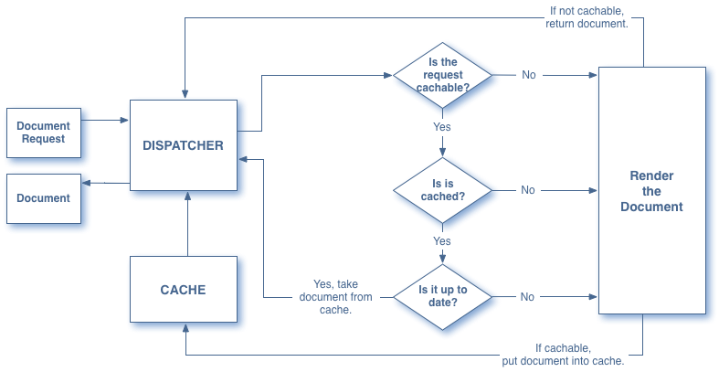
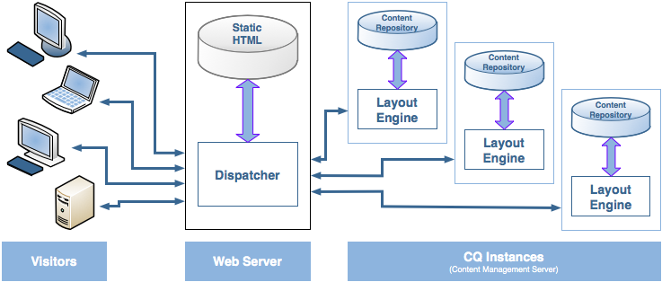

# Dispatcher 개요 {#dispatcher-overview}

>[!NOTE]
>
>Dispatcher 버전은 AEM과 독립적입니다. 이전 버전의 AEM에 대한 설명서에 임베드된 Dispatcher 설명서에 대한 링크를 따라간 경우 이 페이지로 리디렉션되었을 수 있습니다.

Dispatcher는 엔터프라이즈급 웹 서버와 함께 사용하는 Adobe Experience Manager의 캐싱 및 로드 밸런싱 도구입니다.

Dispatcher 배포 프로세스는 선택한 웹 서버 및 OS 플랫폼과 독립적입니다.

1. Dispatcher에 대해 알아보십시오(이 페이지). 또한 [Dispatcher에 대해 자주 묻는 질문](/help/using/dispatcher-faq.md)을 참조하십시오.
1. 웹 서버 설명서에 따라 [지원되는 웹 서버](https://experienceleague.adobe.com/docs/experience-manager-65/deploying/introduction/technical-requirements.html?lang=ko-KR)를 설치하십시오.
1. 웹 서버에 [Dispatcher 모듈을 설치](dispatcher-install.md) 하고 그에 따라 웹 서버를 구성합니다.
1. [Dispatcher 구성](dispatcher-configuration.md) (dispatcher.any 파일).
1. 콘텐츠 업데이트가 캐시를 무효화하도록 [AEM을 구성](page-invalidate.md) 합니다.

>[!NOTE]
>
>Dispatcher가 AEM에서 작동하는 방식을 보다 잘 이해하려면
>
>* [2017년 7월 AEM 커뮤니티 전문가에게 질문하기](https://communities.adobeconnect.com/pf0gem7igw1f/)를 참조하십시오.
>* [이 저장소](https://github.com/adobe/aem-dispatcher-experiments)에 액세스하십시오. 여기에는 “테이크 홈” 실험실 포맷의 실험 모음이 포함되어 있습니다.


필요에 따라 다음 정보를 사용하십시오.

* [Dispatcher 보안 검사 목록](security-checklist.md)
* [Dispatcher 기술 자료](https://helpx.adobe.com/kr/experience-manager/kb/index/dispatcher.html)
* [캐시 성능을 위한 웹 사이트 최적화](https://experienceleague.adobe.com/docs/experience-manager-65/deploying/configuring/configuring-performance.html)
* [여러 도메인에 Dispatcher 사용](dispatcher-domains.md)
* [Dispatcher에 SSL 사용](dispatcher-ssl.md)
* [권한 구분 캐싱 구현](permissions-cache.md)
* [Dispatcher 문제 해결](dispatcher-troubleshooting.md)
* [Dispatcher 주요 문제 FAQ](dispatcher-faq.md)

>[!NOTE]
>
>**Dispatcher의 가장 일반적인 사용** 은 AEM **게시 인스턴스**&#x200B;의 응답을 캐시하여 외부에서 게시되는 웹 사이트의 응답성과 보안을 향상시키는 것입니다. 대부분의 토론에서는 이 경우에 중점을 둡니다.
>
>하지만 특히 웹 사이트를 편집하고 업데이트하는 사용자 수가 많은 경우 Dispatcher를 사용하여 **작성자 인스턴스**&#x200B;의 응답성을 향상시킬 수도 있습니다. 이 경우에 특정적인 세부 사항은 아래에서 [작성자 서버에 Dispatcher 사용](#using-a-dispatcher-with-an-author-server)을 참조하십시오.

## Dispatcher를 사용하여 캐싱을 구현하는 이유는 무엇입니까? {#why-use-dispatcher-to-implement-caching}

웹 게시에 대한 두 가지 기본 접근 방법이 있습니다.

* Apache 또는 IIS와 같은 **정적 웹 서버**&#x200B;는 간단하지만 빠릅니다.
* **콘텐츠 관리 서버**: 동적, 실시간, 지능형 콘텐츠를 제공하지만 더 많은 계산 시간 및 기타 리소스를 필요로 합니다.

Dispatcher는 빠르고 동적인 환경을 인식하도록 도와줍니다. 다음과 같은 목표를 가지고 Apache와 같은 정적 HTML 서버의 일부로 작동합니다.

* 정적 웹 사이트의 형태로 가능한 한 많은 사이트 콘텐츠를 저장(또는 &quot;캐싱&quot;)합니다.
* 가능한 한 적은 레이아웃 엔진에 액세스합니다.

즉, 다음과 같은 의미입니다.

* **정적 콘텐츠**&#x200B;는 정적 웹 서버에서 같은 속도로 쉽게 처리됩니다. 또한 정적 웹 서버에 사용할 수 있는 관리 및 보안 도구를 사용할 수 있습니다.

* **다이내믹 콘텐츠는 절대적으로 필요하지 않은 이상 시스템을 느리게 하지 않고 필요한 만큼 생성됩니다.**

Dispatcher에는 동적 사이트의 콘텐츠를 기반으로 정적 HTML을 생성하고 업데이트하는 메커니즘이 포함되어 있습니다. 정적 파일로 저장되는 문서와 항상 동적으로 생성되는 항목을 상세하게 지정할 수 있습니다.

이 섹션은 이 프로세스의 원칙을 보여 줍니다.

### 정적 웹 서버 {#static-web-server}


Apache 또는 IIS와 같은 정적 웹 서버는 웹 사이트 방문자에게 정적 HTML 파일을 제공합니다. 정적 페이지는 한 번 생성되므로 각 요청에 대해 동일한 콘텐츠가 전달됩니다.

이 프로세스는 간단하고 효율적입니다. 방문자가 HTML 페이지와 같은 파일을 요청하는 경우 파일은 대개 메모리에서 직접 가져오며, 최악의 경우 로컬 드라이브에서 읽습니다. 정적인 웹 서버는 꽤 오랫동안 제공되어 왔으며, 관리와 보안 관리를 위한 다양한 도구가 있으며, 네트워크 인프라와 잘 통합되었습니다.

### 콘텐츠 관리 서버 {#content-management-servers}


AEM과 같은 CMS(콘텐츠 관리 서버)를 사용하는 경우 고급 레이아웃 엔진이 방문자의 요청을 처리합니다. 엔진은 스타일, 포맷 및 액세스 권한과 함께 저장소에서 콘텐츠를 읽어 방문자의 요구 사항 및 권한에 맞는 문서로 변환합니다.

이 워크플로를 통해 보다 풍부하고 다이내믹한 콘텐츠를 제작할 수 있으므로 웹 사이트의 유연성과 기능을 향상시킬 수 있습니다. 그러나 레이아웃 엔진은 정적 서버보다 처리 능력이 더 필요하므로 많은 방문자가 시스템을 사용하는 경우 이 설정을 지연시킬 수 있습니다.

## Dispatcher에서 캐싱을 수행하는 방법 {#how-dispatcher-performs-caching}



**캐시 디렉터리** 캐싱을 위해 Dispatcher 모듈은 정적 콘텐츠를 제공하는 웹 서버의 기능을 사용합니다. Dispatcher는 캐시된 문서를 웹 서버의 문서 루트에 배치합니다.

>[!NOTE]
>
>HTTP 헤더 캐싱에 대한 구성이 부족한 경우 Dispatcher는 페이지의 HTML 코드만 저장합니다. 이 코드는 HTTP 헤더를 저장하지 않습니다. 이 시나리오는 웹 사이트 내에서 다른 인코딩을 사용하는 경우 해당 페이지가 손실될 수 있으므로 문제가 될 수 있습니다. HTTP 헤더 캐시를 활성화하려면 [Dispatcher 캐시 구성](https://experienceleague.adobe.com/docs/experience-manager-dispatcher/using/configuring/dispatcher-configuration.html?lang=ko-KR)

>[!NOTE]
>
>NAS(Network Attached Storage)에서 웹 서버의 문서 루트를 찾으면 성능이 저하됩니다. 또한 NAS의 문서 루트가 여러 웹 서버 간에 공유되면 복제 작업이 수행될 때 간헐적으로 잠금이 발생할 수 있습니다.

>[!NOTE]
>
>Dispatcher는 캐시된 문서를 요청된 URL과 같은 구조로 저장합니다.
>
>파일 이름의 길이에 대한 OS 수준의 제한이 있을 수 있습니다. 선택기가 많은 URL이 있는 경우입니다.

### 캐싱 방법

Dispatcher에는 웹 사이트를 변경할 때 캐시 콘텐츠를 업데이트하는 두 가지 기본 방법이 있습니다.

* **콘텐츠 업데이트**&#x200B;는 변경된 파일과 직접 연결된 파일을 제거합니다.
* **자동 무효화**&#x200B;는 업데이트 후 오래된 캐시 부분을 자동으로 무효화합니다. 즉, 관련 페이지를 삭제하지 않고 최신 상태가 아닌 것으로 효과적으로 플래그를 지정합니다.

### 콘텐츠 업데이트

콘텐츠 업데이트에서 하나 이상의 AEM 문서가 변경됩니다. AEM은 Dispatcher에 등록 요청을 전송하여 그에 따라 캐시를 업데이트합니다.

1. 캐시에서 수정된 파일을 삭제합니다.
1. 캐시에서 동일한 핸들로 시작하는 모든 파일을 삭제합니다. 예: 파일 /en/index.html이 업데이트되면 /en/index로 시작하는 모든 파일 이 삭제됩니다. 이 메커니즘을 통해 특히 사진 탐색에 대한 캐시 효율적인 사이트를 설계할 수 있습니다.
1. 소위 *statfile*&#x200B;을 **터치**&#x200B;합니다. 그러면 상태 파일의 타임스탬프가 업데이트되어 마지막 변경 날짜의 날짜가 표시됩니다.

다음 요점을 명시해야 합니다.

* 콘텐츠 업데이트는 일반적으로 대체해야 하는 항목을 “아는” 작성 시스템과 함께 사용됩니다.
* 콘텐츠 업데이트의 영향을 받는 파일은 제거되지만 즉시 대체되지 않습니다. 다음 번에 이러한 파일이 대체되면 Dispatcher는 AEM 인스턴스에서 새 파일을 가져오고 캐시에 배치하여 이전 콘텐츠를 덮어씁니다.
* 일반적으로 페이지에서 텍스트를 통합하는 자동 생성된 사진은 같은 핸들로 시작하는 사진 파일에 저장되어 삭제를 위한 연결이 존재하도록 합니다. 예를 들어 같은 폴더에 사진 mypage.titlePicture.gif로 페이지 mypage.html의 제목 테스트를 저장할 수 있습니다. 이 방법으로 페이지가 업데이트될 때마다 사진은 캐시에서 자동으로 삭제되므로 사진이 항상 페이지의 현재 버전을 반영한다는 것을 확인할 수 있습니다.
* 여러 개의 상태 파일이 있을 수 있습니다(예: 언어 폴더별 1개). 페이지가 업데이트되면 AEM은 상태 파일이 포함된 다음 상위 폴더를 찾아 해당 파일을 *수정* 합니다.

### 자동 무효화

자동 무효화는 파일을 실제로 삭제하지 않고 캐시의 일부를 자동으로 무효화합니다. 모든 콘텐츠 업데이트에서는 소위 상태 파일이 터치되므로 해당 타임스탬프가 마지막 콘텐츠 업데이트를 반영합니다.

Dispatcher에는 자동 무효화의 대상이 되는 파일 목록이 있습니다. 해당 목록의 문서가 요청되면 Dispatcher는 캐시된 문서의 날짜를 상태 파일의 타임스탬프와 비교합니다.

* 캐시된 문서가 최신 문서인 경우 Dispatcher가 이를 반환합니다.
* 이전 버전인 경우 Dispatcher는 AEM 인스턴스에서 현재 버전을 검색합니다.

다시 한 번, 특정 요점을 명시해야 합니다.

* 자동 무효화는 일반적으로 HTML 페이지와 같이 상호 관계가 복잡할 때 사용됩니다. 이러한 페이지에는 링크 및 탐색 항목이 포함되어 있으므로 일반적으로 콘텐츠 업데이트 후에 업데이트해야 합니다. PDF 또는 사진 파일을 자동으로 생성한 경우 해당 파일을 자동으로 무효화하도록 선택할 수도 있습니다.
* 자동 무효화는 상태 파일을 수정하는 것 외에는 업데이트 시 Dispatcher가 수행하는 작업을 포함하지 않습니다. 그러나 상태 파일을 수정하면 캐시 콘텐츠가 캐시에서 물리적으로 제거되지 않고 자동으로 사용되지 않습니다.

## Dispatcher가 문서를 반환하는 방법 {#how-dispatcher-returns-documents}



### 문서의 캐시 대상 여부 확인

[Dispatcher가 구성 파일에서 캐시하는 문서를 정의할 수 있습니다](https://experienceleague.adobe.com/docs/experience-manager-dispatcher/using/configuring/dispatcher-configuration.html?lang=ko-KR). Dispatcher는 캐시 가능한 문서 목록에 대해 요청을 확인합니다. 문서가 이 목록에 없으면 Dispatcher가 AEM 인스턴스에서 문서를 요청합니다.

Dispatcher가 다음의 경우 AEM 인스턴스에서 직접 문서를 항상 요청합니다.

* 요청 URI에는 물음표 “`?`”가 포함됩니다. 일반적으로 이 시나리오는 검색 결과와 같은 동적 페이지를 나타내며 캐시할 필요가 없습니다.
* 파일 확장명이 없습니다. 웹 서버에는 문서 유형(MIME 유형)을 결정하기 위한 확장명이 필요합니다.
* 인증 헤더가 설정됩니다(구성 가능).

>[!NOTE]
>
>GET 또는 HEAD(HTTP 헤더의 경우) 메서드는 Dispatcher에서 캐시할 수 있습니다. 응답 헤더 캐싱에 대한 추가 정보는 [HTTP 응답 헤더 캐싱](https://experienceleague.adobe.com/docs/experience-manager-dispatcher/using/configuring/dispatcher-configuration.html?lang=ko-KR) 섹션을 참조하십시오.

### 문서가 캐시되는지 확인

Dispatcher는 캐시된 파일을 정적 웹 사이트의 일부인 것처럼 웹 서버에 저장합니다. 사용자가 캐시 가능한 문서를 요청하는 경우 Dispatcher는 해당 문서가 웹 서버의 파일 시스템에 있는지 여부를 확인합니다.

* 문서가 캐시되면 Dispatcher가 파일을 반환합니다.
* 캐시되지 않으면 Dispatcher가 AEM 인스턴스에서 문서를 요청합니다.

### 문서가 최신 상태인지 확인

문서가 최신 상태인지 확인하려면 Dispatcher에서 다음 두 단계를 수행합니다.

1. 문서가 자동 무효화 대상인지 여부를 확인합니다. 그렇지 않으면 문서가 최신 문서로 간주됩니다.
1. 문서가 자동 무효화되도록 구성된 경우 Dispatcher는 사용 가능한 마지막 변경 내용보다 오래되었는지 여부를 확인합니다. 이전 버전인 경우 Dispatcher는 AEM 인스턴스에서 현재 버전을 요청하고 캐시에 있는 버전을 대체합니다.

>[!NOTE]
>
>**자동 무효화**&#x200B;가 없는 문서는 물리적으로 삭제될 때까지 캐시에 남아 있습니다. 예: 웹 사이트의 콘텐츠 업데이트.

## 로드 밸런싱의 이점 {#the-benefits-of-load-balancing}

로드 밸런싱은 여러 AEM 인스턴스에 웹 사이트의 계산 로드를 배포하는 방법입니다.



얻을 수 있는 이점:

* **향상된 처리 능력**
실제로 향상된 처리 능력은 Dispatcher가 여러 AEM 인스턴스 간에 문서 요청을 공유함을 의미합니다. 이제 각 인스턴스에 처리할 문서가 적으므로 응답 시간이 빨라집니다. Dispatcher는 각 문서 범주에 대한 내부 통계를 유지하므로 로드를 예측하고 쿼리를 효율적으로 배포할 수 있습니다.

* **실패 시 보장 범위 증가**
Dispatcher가 인스턴스로부터 응답을 받지 못하면 자동으로 요청을 다른 인스턴스 중 하나로 전달합니다. 인스턴스를 사용할 수 없게 되면 그 유일한 효과는 계산 능력이 손실되는 정도에 비례한 사이트의 둔화입니다. 단, 모든 서비스는 계속 제공됩니다.

* 동일한 정적 웹 서버에서 서로 다른 웹 사이트를 관리할 수도 있습니다.

>[!NOTE]
>
>로드 밸런싱은 부하를 효율적으로 분산시키는 반면 캐싱은 부하를 줄이는 데 도움이 됩니다. 따라서 로드 밸런싱을 설정하기 전에 캐싱을 최적화하고 전체 로드를 줄이십시오. 캐싱이 좋을수록 로드 밸런서의 성능이 향상되거나 로드 밸런싱이 불필요하게 렌더링될 수 있습니다.

>[!CAUTION]
>
>단일 Dispatcher는 사용 가능한 게시 인스턴스의 용량을 채울 수 있지만 일부 드문 애플리케이션의 경우 두 Dispatcher 인스턴스 간의 로드 균형을 조정할 수도 있습니다. 추가 Dispatcher가 사용 가능한 게시 인스턴스의 로드를 늘리고 대부분의 애플리케이션의 성능을 쉽게 줄일 수 있으므로 여러 Dispatcher가 있는 구성을 신중하게 고려해야 합니다.

## Dispatcher가 로드 밸런싱을 수행하는 방법 {#how-the-dispatcher-performs-load-balancing}

### 성능 통계

Dispatcher는 AEM의 각 인스턴스가 문서를 처리하는 속도에 대한 내부 통계를 유지합니다. 이 데이터를 기반으로, Dispatcher는 요청에 응답할 때 가장 빠른 응답 시간을 제공할 수 있는 인스턴스를 예측하여 해당 인스턴스에서 필요한 계산 시간을 예약합니다.

요청 유형마다 평균 완료 시간이 다를 수 있으므로 Dispatcher를 통해 문서 범주를 지정할 수 있습니다. 그런 다음 시간 예측을 계산할 때 해당 범주를 고려합니다. 예를 들어 일반적인 응답 시간이 다를 수 있으므로 HTML 페이지와 이미지를 구분할 수 있습니다.

정교한 검색 기능을 사용하는 경우 검색 쿼리에 대한 범주를 만들 수 있습니다. 이 메서드를 통해 Dispatcher가 검색 쿼리를 가장 빠르게 응답하는 인스턴스로 보낼 수 있습니다. 또한 이를 통해 여러 “값비싼” 검색 쿼리를 받고 다른 항목에서 “더 저렴한“ 요청을 받는 경우 지연으로부터 더 느린 인스턴스가 방지됩니다.

### 개인화된 콘텐츠 (고정 연결)

고정 연결은 한 명의 사용자에 대한 문서가 AEM의 동일한 인스턴스에서 모두 구성된다는 것을 보장합니다. 이 시점은 개인화된 페이지 및 세션 데이터를 사용하는 경우 중요합니다. 데이터는 인스턴스에 저장되므로 동일한 사용자의 후속 요청은 해당 인스턴스에 반환해야 합니다. 그렇지 않으면 데이터가 손실됩니다.

고정 연결은 Dispatcher의 요청을 최적화하는 기능을 제한하므로 필요한 경우에만 사용해야 합니다. 고정 문서를 포함하는 폴더를 지정할 수 있으므로 해당 폴더의 모든 문서가 각 사용자에 대해 동일한 인스턴스에 작성되도록 할 수 있습니다.

>[!NOTE]
>
>고정 연결을 사용하는 대부분의 페이지의 경우 캐싱을 해제해야 합니다. 그렇지 않으면 세션 콘텐츠에 관계없이 모든 사용자와 페이지가 동일하게 표시됩니다.
>
>*몇몇* 애플리케이션의 경우 고정 연결 및 캐싱 모두를 사용할 수 있습니다(예: 세션에 데이터를 작성하는 양식을 표시하는 경우).

## 여러 Dispatcher 사용 {#using-multiple-dispatchers}

복잡한 설정에서 여러 Dispatcher를 사용할 수 있습니다. 예를 들어 다음을 사용할 수 있습니다.

* 인트라넷에 웹 사이트를 게시할 하나의 Dispatcher
* 다른 주소와 보안 설정이 다른 두 번째 Dispatcher가 동일한 콘텐츠를 인터넷에 게시합니다.

이러한 경우 각 요청이 하나의 Dispatcher만 통과하는지 확인하십시오. Dispatcher는 다른 Dispatcher의 요청을 처리하지 않습니다. 따라서 Dispatcher가 모두 AEM 웹 사이트에 직접 액세스하도록 하십시오.

## CDN에 Dispatcher 사용 {#using-dispatcher-with-a-cdn}

Akamai Edge Delivery 또는 Amazon Cloud Front와 같은 CDN(콘텐츠 게재 네트워크)은 최종 사용자에게 가까운 위치에서 콘텐츠를 제공합니다. 이로 인해

* 최종 사용자의 응답 시간 단축
* 서버 로드 해제

HTTP 인프라 구성 요소로서 CDN은 Dispatcher와 유사하게 작동합니다. CDN 노드가 요청을 받으면 가능한 경우 캐시에서 요청을 처리합니다(리소스는 캐시에서 사용할 수 있으며 유효합니다). 그렇지 않으면 리소스를 검색하고 적절한 경우 추가 요청을 위해 캐시하기 위해 다음으로 가장 가까운 서버에 연결됩니다.

다음으로 가장 가까운 서버는 특정 설정에 따라 다릅니다. 예를 들어 Akamai 설정에서 요청은 다음 경로를 취할 수 있습니다.

* Akamai 에지 노드
* Akamai Midgres 레이어
* 방화벽
* 로드 밸런서
* Dispatcher
* AEM

일반적으로 Dispatcher는 캐시에서 문서를 제공하고 CDN 서버로 반환되는 응답 헤더에 영향을 줄 수 있는 다음 서버입니다.

## CDN 캐시 제어 {#controlling-a-cdn-cache}

CDN이 Dispatcher에서 다시 가져오기 전에 리소스를 캐시하는 시간을 제어하는 방법에는 몇 가지가 있습니다.

1. 명시적 구성\
   MIME 유형, 확장, 요청 유형 등에 따라 CDN의 캐시에서 특정 리소스가 얼마나 오래 보관되는지를 구성합니다.

1. 만료 및 캐시 제어 헤더\
   대부분의 CDN은 업스트림 서버에서 보내는 경우 `Expires:` 및 `Cache-Control:` HTTP 헤더를 처리합니다. 예를 들어 [mod_expires](https://httpd.apache.org/docs/2.4/mod/mod_expires.html) Apache Module을 사용하여 이 메서드를 달성할 수 있습니다.

1. 수동 무효화\
   CDN을 사용하면 웹 인터페이스를 통해 캐시에서 리소스를 제거할 수 있습니다.
1. API 기반 무효화\
   또한 대부분의 CDN은 캐시에서 리소스를 제거할 수 있는 REST 및/또는 SOAP API를 제공합니다.

일반적인 AEM 설정에서 확장 및 경로별 또는 두 가지 구성은 위의 포인트 1과 2를 통해 수행할 수 있으며, 디자인 이미지 및 클라이언트 라이브러리와 같이 자주 변경되지 않는 자주 사용하는 리소스에 대해 적절한 캐싱 기간을 설정할 수 있습니다. 새 릴리스가 배포되면 일반적으로 수동 무효화가 필요합니다.

이 방법을 사용하여 관리 콘텐츠를 캐시하는 경우 구성된 캐싱 기간이 만료되고 문서를 다시 Dispatcher에서 가져오는 경우에만 콘텐츠 변경 사항이 최종 사용자에게 표시된다는 의미입니다.

보다 세밀하게 조정하기 위해 API 기반 무효화를 통해 Dispatcher 캐시가 무효화되므로 CDN 캐시를 무효화할 수 있습니다. CDN API를 기반으로 고유한 [ContentBuilder](https://developer.adobe.com/experience-manager/reference-materials/6-5/javadoc/com/day/cq/replication/ContentBuilder.html) 및 [TransportHandler](https://developer.adobe.com/experience-manager/reference-materials/6-5/javadoc/com/day/cq/replication/TransportHandler.html)를 구현하고 (API가 REST 기반이 아닌 경우) CDN의 캐시를 무효화하는 데 해당 조각을 사용하는 복제 에이전트를 설정할 수 있습니다.

>[!NOTE]
>
>[AEM (CQ) Dispatcher 보안 및 CDN+브라우저 캐싱](https://www.slideshare.net/andrewmkhoury/dispatcher-caching-aemgemspart2jan2015)과 [Dispatcher 캐싱](https://experienceleague.adobe.com/docs/experience-manager-gems-events/gems/gems2015/aem-dispatcher-caching-new-features-and-optimizations.html?lang=ko-KR)에 대한 녹화된 프레젠테이션을 참조하십시오.

## 작성자 서버에 Dispatcher 사용 {#using-a-dispatcher-with-an-author-server}

>[!CAUTION]
>
>[Touch UI가 있는 AEM](https://experienceleague.adobe.com/docs/experience-manager-65/developing/introduction/touch-ui-concepts.html?lang=ko-KR)을 사용하는 경우 작성자 인스턴스 콘텐츠를 캐시하지 **마십시오**. 작성자 인스턴스에 대해 캐싱이 활성화된 경우 이를 비활성화하고 캐시 디렉터리의 콘텐츠를 삭제해야 합니다. 캐싱을 비활성화하려면 `author_dispatcher.any` 파일을 편집하고 `/rule` 섹션의 `/cache` 속성을 다음과 같이 수정합니다.

```xml
/rules
{
/0000
{ /type "deny" /glob "*"}
}
```

작성자 인스턴스 앞에 Dispatcher를 사용하여 작성 성능을 향상시킬 수 있습니다. 작성 Dispatcher를 구성하려면 다음 작업을 수행하십시오.

1. 웹 서버에 Dispatcher를 설치합니다(Apache 또는 IIS 웹 서버는 [Dispatcher 설치](dispatcher-install.md) 참조).
1. 작업 중인 AEM 게시 인스턴스에 대해 새로 설치된 Dispatcher를 테스트합니다. 이렇게 하면 기준 수정 설치가 수행됩니다.
1. 이제 Dispatcher가 TCP/IP를 통해 작성자 인스턴스에 연결할 수 있는지 확인합니다.
1. 샘플 `dispatcher.any` 파일을 [Dispatcher 다운로드](release-notes.md#downloads)와 함께 제공된 `author_dispatcher.any` 파일로 대체합니다.
1. 텍스트 편집기에서 `author_dispatcher.any`를 열고 다음 사항을 변경합니다.

   1. 작성자 인스턴스를 가리키도록 `/renders` 섹션의 `/hostname` 및 `/port`를 변경합니다.
   1. 캐시 디렉터리를 가리키도록 `/cache` 섹션의 `/docroot`을 변경합니다. [Touch UI가 있는 AEM](https://experienceleague.adobe.com/docs/experience-manager-65/developing/introduction/touch-ui-concepts.html?lang=ko-KR)를 사용하는 경우 위의 경고를 참조하십시오.
   1. 변경 사항을 저장합니다.

1. 위에서 구성한 `/cache` > `/docroot` 디렉터리에서 기존 파일을 모두 삭제합니다.
1. 웹 서버를 다시 시작합니다.

>[!NOTE]
>
>제공된 `author_dispatcher.any` 구성을 통해 `/libs` 또는 `/apps`에서 콘텐츠에 영향을 주는 CQ5 기능 팩, 핫픽스 또는 애플리케이션 코드 패키지를 설치하는 경우 Dispatcher 캐시의 이러한 디렉터리에서 캐싱된 파일을 삭제해야 합니다. 이렇게 하면 다음 번에 요청될 때 이전에 캐싱된 항목이 아닌 새로 업그레이드된 파일을 가져오게 됩니다.

>[!CAUTION]
>
>이전에 구성한 작성자 Dispatcher를 사용하고 *Dispatcher 플러시 에이전트*&#x200B;를 활성화한 경우 다음 작업을 수행할 수 있습니다.

1. AEM 작성자 인스턴스에서 **작성자 Dispatcher의** 플러시 에이전트를 삭제하거나 비활성화합니다.
1. 위의 새로운 지침에 따라 작성자 Dispatcher 구성을 다시 실행합니다.

<!--
[Author Dispatcher configuration file (Dispatcher 4.1.2 or later)](assets/author_dispatchernew.any)
-->
<!--[!NOTE]
>
>A related knowledge base article can be found here:  
>[How to configure the dispatcher in front of an authoring environment](https://helpx.adobe.com/cq/kb/HowToConfigureDispatcherForAuthoringEnvironment.html)
-->
