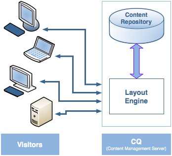

# Dispatcher 개요 {#dispatcher-overview}

>[!NOTE]
>
>발송자 버전은 AEM와 독립적입니다. 이전 버전의 AEM에 대한 설명서에 포함된 Dispatcher 설명서에 대한 링크를 팔로우한 경우 이 페이지로 리디렉션되었을 수 있습니다.

Dispatcher는 Adobe Experience Manager의 캐싱 및/또는 로드 밸런싱 툴입니다. AEM의 Dispatcher를 사용하면 공격으로부터 AEM 서버를 보호할 수도 있습니다. 따라서, Enterprise-Class 웹 서버와 함께 Dispatcher를 사용하여 AEM 인스턴스의 보안을 강화할 수 있습니다.

디스패처를 배포하는 프로세스는 선택한 웹 서버 및 OS 플랫폼에 독립적입니다.

1. 디스패처 (이 페이지) 에 대해 알아보십시오. Dispatcher [](https://helpx.adobe.com/experience-manager/using/dispatcher-faq.html)에 대한 FAQ도 참조하십시오.
1. 웹 서버 설명서에 따라 [지원되는 웹 서버를](https://helpx.adobe.com/experience-manager/6-3/sites/deploying/using/technical-requirements.html) 설치합니다.

1. [웹 서버에 Dispatcher 모듈을](dispatcher-install.md) 설치하고 그에 따라 웹 서버를 구성합니다.
1. [Dispatcher](dispatcher-configuration.md) (Dispatcher. any 파일) 를 구성합니다.

1. [컨텐츠 업데이트가 캐시를 무효화하도록 AEM](page-invalidate.md) 를 구성합니다.

>[!NOTE]
>
>AEM에서 디스패처가 작동하는 방식을 더 잘 이해하려면 2017 년 7 월 AEM Community 전문가에게 [물어보세요](https://bit.ly/ATACE0717).

필요에 따라 다음 정보를 사용하십시오.

* [Dispatcher 보안 검사 목록](security-checklist.md)
* [Dispatcher 기술 자료](https://helpx.adobe.com/cq/kb/index/dispatcher.html)
* [캐시 성능을 위한 웹 사이트 최적화](https://helpx.adobe.com/experience-manager/6-4/sites/deploying/using/configuring-performance.html)
* [여러 도메인이 있는 Dispatcher 사용](dispatcher-domains.md)
* [Dispatcher와 SSL 사용](dispatcher-ssl.md)
* [권한 감지 캐싱 구현](permissions-cache.md)
* [Dispatcher 문제 해결](dispatcher-troubleshooting.md)
* [Dispatcher 주요 문제 FAQ](dispatcher-faq.md)

>[!NOTE]
>
>**Dispatcher** 의 가장 일반적인 용도는 AEM **게시 인스턴스의**응답을 캐시하여 외부에서 게시된 웹 사이트의 응답성과 보안을 높이는 것입니다. 대부분의 토론은 이 사례에 중점을 둡니다.
>
>그러나 디스패처를 사용하면 특히 사용자가 웹 사이트를 편집하고 업데이트할 때 **작성자 인스턴스의**응답성을 높일 수 있습니다. 이 경우에 대한 자세한 내용은 아래 작성자 서버와 함께 Dispatcher [사용을 참조하십시오](#using-a-dispatcher-with-an-author-server).

## Dispatcher를 사용하여 캐싱을 구현하는 이유는 무엇입니까? {#why-use-dispatcher-to-implement-caching}

웹 게시에 대한 기본적인 접근 방법은 다음과 같습니다.

* **정적 웹 서버**: Apache 또는 IIS와 같이 매우 간단하지만 빠릅니다.
* **컨텐츠 관리 서버**: 동적 실시간 인텔리전트 컨텐츠를 제공하지만 계산 시간 및 기타 리소스가 훨씬 더 필요합니다.

Dispatcher를 사용하면 빠르고 동적인 환경을 구현할 수 있습니다. 이 플러그인은 Apache와 같은 정적 HTML 서버의 일부로서 작동합니다.

* 정적 웹 사이트의 형태로 가능한 많은 사이트 컨텐츠를 가능한 한 저장 (또는 &quot;캐싱&quot;)
* 레이아웃 엔진에 최대한 액세스

즉, 다음을 의미합니다.

* **정적 컨텐츠는** 정적 웹 서버와 동일한 속도와 속도를 사용하여 처리됩니다.*또한 정적 웹 서버에 대해 사용 가능한 관리 및 보안 도구를 사용할*수도 있습니다.

* **필요한 만큼 시스템을 느리게 만들지 않고 필요에 따라 동적 컨텐츠가** 생성됩니다.

디스패처에는 동적 사이트의 컨텐츠를 기반으로 정적 HTML를 생성하고 업데이트하는 메커니즘이 포함되어 있습니다. 정적 파일로 저장되는 문서를 자세히 지정할 수 있으며 항상 동적으로 생성됩니다.

This section shows the principle behind this.

### 정적 웹 서버 {#static-web-server}


Apache 또는 IIS와 같은 정적 웹 서버는 웹 사이트의 방문자에게 정적 HTML 파일을 제공합니다. 정적 페이지는 한 번만 만들어지므로 각 요청에 대해 동일한 컨텐츠가 전달됩니다.

이 프로세스는 매우 간단하므로 매우 효율적입니다. 방문자가 파일을 요청하는 경우 (예: HTML 페이지) 파일은 보통 메모리에서 직접 가져오며 로컬 드라이브에서 읽기가 최악의 경우 실행됩니다. 정적 웹 서버는 오랫동안 사용할 수 있었지만 관리 및 보안 관리를 위한 다양한 도구가 있으며 네트워크 인프라와 완벽하게 통합됩니다.

### 컨텐츠 관리 서버 {#content-management-servers}



AEM와 같은 컨텐츠 관리 서버를 사용하는 경우 고급 레이아웃 엔진은 방문자의 요청을 처리합니다. 엔진은 스타일, 포맷 및 액세스 권한과 결합된 저장소의 컨텐츠를 읽고 방문자의 요구 사항과 권한에 맞게 제작된 문서로 컨텐츠를 변환합니다.

이를 통해 다이내믹한 리치 컨텐츠를 만들 수 있으므로 웹 사이트의 유연성과 기능을 향상시킬 수 있습니다. 그러나 레이아웃 엔진은 정적 서버보다 처리 능력이 더 강하기 때문에, 이 설정은 많은 방문자가 시스템을 사용하는 경우 느려질 수 있습니다.

## 디스패처가 캐싱을 수행하는 방식 {#how-dispatcher-performs-caching}


**캐싱을** 위한 캐시 디렉토리인 Dispatcher 모듈은 정적 컨텐츠를 제공하는 웹 서버의 기능을 사용합니다. Dispatcher는 캐시된 문서를 웹 서버의 문서 루트에 저장합니다.

>[!NOTE]
>
>HTTP 헤더 캐싱에 대한 구성이 부족할 때 디스패처는 페이지의 HTML 코드만 저장하며 HTTP 헤더를 저장하지 않습니다. 이러한 기능은 웹 사이트에서 다른 인코딩을 사용하는 경우 손실될 수 있습니다. HTTP 헤더 캐싱을 활성화하려면 Dispatcher 캐시 [구성을 참조하십시오.](https://helpx.adobe.com/experience-manager/dispatcher/using/dispatcher-configuration.html)

>[!NOTE]
>
>NAS (Network Attached Storage) 에서 웹 서버의 문서 루트를 찾으면 성능 저하가 발생합니다. 또한 NAS에 있는 문서 루트를 여러 웹 서버 간에 공유하는 경우 복제 작업이 수행될 때 간헐적으로 잠길 수 있습니다.

>[!NOTE]
>
>Dispatcher는 캐시된 문서를 요청된 URL와 같은 구조에 저장합니다.
>
>파일 이름의 길이에 대한 OS 레벨 제한이 있을 수 있습니다. 예를 들어, 선택기가 많이 포함된 URL 이 있는 경우

### 캐싱 방법

디스패처에는 웹 사이트를 변경할 때 캐시 컨텐츠를 업데이트하는 두 가지 기본 방법이 있습니다.

* **컨텐츠 업데이트는** 변경된 페이지와 직접 연관된 파일을 제거합니다.
* **자동 무효화는** 업데이트 후 오래된 날짜가 될 수 있는 캐시 부분을 자동으로 무효화합니다. i.e. 관련 페이지를 삭제하지 않고 연관성 있는 페이지를 효과적으로 플래깅합니다.

### 컨텐츠 업데이트

컨텐츠 업데이트에서 하나 이상의 AEM 문서가 변경됩니다. AEM는 신디케이션 요청을 디스패처로 보내 그에 따라 캐시를 업데이트합니다.

1. 캐시에서 수정된 파일을 삭제합니다.
1. 캐시에서 동일한 핸들을 사용하여 시작하는 모든 파일을 삭제합니다. 예를 들어 /en/index.html 파일이 업데이트되면 /en/index로 시작하는 모든 파일이 업데이트됩니다. 가 삭제됩니다. 이 메커니즘을 사용하면 특히 사진 탐색과 관련하여 캐시 효율적인 사이트를 디자인할 수 있습니다.
1. Statfile ******를 터치합니다. 이렇게 하면 statfile의 타임스탬프가 업데이트되어 마지막 변경 날짜가 표시됩니다.

다음 사항을 명시해야 합니다.

* 컨텐츠 업데이트는 대체되어야 하는 사항을 &quot;알고 있는&quot; 제작 시스템과 함께 사용됩니다.
* 컨텐츠 업데이트의 영향을 받는 파일은 제거되지만 즉시 대체되지는 않습니다. 그런 다음 이러한 파일이 요청되면, Dispatcher는 AEM 인스턴스에서 새 파일을 가져와 캐시에 넣어 이전 내용을 덮어씁니다.
* 일반적으로 페이지의 텍스트를 통합하는 자동으로 생성된 사진은 같은 처리로 시작하여 그림 파일에 저장되므로 연결이 삭제되도록 합니다. 예를 들어, 페이지 제목 텍스트를 같은 폴더에 있는 mypage. titlepicture. gif 라는 이름으로 저장할 수 있습니다. 이렇게 하면 페이지가 업데이트될 때마다 캐시에서 자동으로 사진이 삭제되므로 항상 최신 버전의 페이지가 반영되도록 할 수 있습니다.
* 여러 개의 Statfiles (예: 언어 폴더당 1 개) 가 있을 수 있습니다. If a page is updated, AEM looks for the next parent folder containing a statfile, and *touches* that file.

### 자동 무효화

자동 무효화는 파일을 물리적으로 삭제하지 않고 캐시의 일부를 자동으로 무효화합니다. 모든 컨텐츠 업데이트에서 소위 statfile 이 터치되므로 타임스탬프가 마지막 컨텐츠 업데이트를 반영합니다.

디스패처에 자동 무효화가 적용되는 파일 목록이 있습니다. 해당 목록의 문서가 요청되면 디스패처는 캐시된 문서의 날짜를 statfile의 타임스탬프와 비교합니다.

* 캐시된 문서가 최신 문서인 경우 디스패처가 반환합니다.
* 이전 버전인 경우, Dispatcher는 AEM 인스턴스에서 현재 버전을 검색합니다.

특정 지점을 주목해야 합니다.

* 자동 무효화는 일반적으로 HTML 페이지의 상관 관계가 복잡한 경우 사용됩니다. 이러한 페이지에는 링크와 탐색 항목이 포함되어 있으므로 컨텐츠 업데이트 후 일반적으로 업데이트해야 합니다. PDF 또는 사진 파일을 자동으로 생성한 경우 자동으로 무효화할 수도 있습니다.
* Statfile를 터치하는 경우를 제외하고는 자동 무효화는 업데이트 시 디스패처의 작업을 포함하지 않습니다. 그러나 Statfile를 터치하면 캐시에서 물리적으로 제거하지 않고 캐시 컨텐츠가 사용되지 않게 렌더링됩니다.

## 디스패처가 문서를 반환하는 방법 {#how-dispatcher-returns-documents}


### 문서가 캐싱되는지 여부 확인

구성 파일에 있는 Dispatcher 캐시로 문서를 [정의할](https://helpx.adobe.com/experience-manager/dispatcher/using/dispatcher-configuration.html)수 있습니다. Dispatcher는 캐시 가능한 문서 목록에 대한 요청을 확인합니다. 문서가 이 목록에 없으면 Dispatcher는 AEM 인스턴스에서 문서를 요청합니다.

Dispatcher는 *항상* 다음 경우에 AEM 인스턴스에서 문서를 요청합니다.

* 요청 URI에 물음표 &quot;?&quot; 가 포함되어 있는 경우 이것은 일반적으로 검색 결과와 같은 동적 페이지를 나타냅니다. 캐싱할 필요가 없습니다.
* 파일 확장자가 없습니다. 웹 서버는 확장자가 있어야 문서 유형 (MIME-type) 를 확인할 수 있습니다.
* 인증 헤더가 설정됨 (구성 가능)

>[!NOTE]
>
>GET 또는 HEAD (HTTP 헤더 경우) 메서드는 디스패처가 캐시할 수 있습니다. 응답 헤더 캐싱에 대한 자세한 내용은 HTTP 응답 헤더 [캐싱](https://helpx.adobe.com/experience-manager/dispatcher/using/dispatcher-configuration.html) 섹션을 참조하십시오.

### 문서가 캐시되는지 확인

디스패처는 캐시된 파일을 정적 웹 사이트의 일부인 것처럼 웹 서버에 저장합니다. 사용자가 캐시 가능한 문서를 요청하면 디스패처는 해당 문서가 웹 서버의 파일 시스템에 있는지 여부를 확인합니다.

* 문서가 캐시되면 Dispatcher에서 파일을 반환합니다.
* 캐시되지 않으면 Dispatcher는 AEM 인스턴스에서 문서를 요청합니다.

### 문서가 최신 버전인지 확인

문서가 최신 버전인지 확인하려면 Dispatcher에서 다음 두 단계를 수행합니다.

1. 문서가 자동 무효화의 대상이 되는지 확인합니다. 그렇지 않으면 문서가 최신 상태로 간주됩니다.
1. 문서가 자동 무효화를 위해 구성된 경우 디스패처는 사용 가능한 마지막 변경 내용보다 이전 버전인지 또는 오래된 버전인지 확인합니다. 이전 버전인 경우, Dispatcher는 AEM 인스턴스에서 현재 버전을 요청하고, 캐시에 있는 버전을 대체합니다.

>[!NOTE]
>
>자동 무효화 없는 **문서는 물리적으로 삭제될 때까지 캐시에** 남아 있습니다. 예: 웹 사이트의 컨텐츠 업데이트.

## 로드 밸런싱 이점 {#the-benefits-of-load-balancing}

부하 균형 조정은 웹 사이트의 계산 부하를 AEM의 여러 인스턴스에 배포하는 방법입니다.


얻을 수 있는 이점:

* **처리 능력이**
향상되었으며, 이는 디스패처가 AEM의 여러 인스턴스 사이에 문서 요청을 공유한다는 것을 의미합니다. 각 인스턴스는 처리할 문서가 더 적으므로 응답 시간이 단축됩니다. 디스패처는 각 문서 카테고리에 대한 내부 통계를 유지하므로, 로드를 예측하고 쿼리를 효율적으로 배포할 수 있습니다.

* **Fail-safe 서비스**
증가 Dispatcher가 인스턴스의 응답을 받지 못하면 다른 인스턴스 중 하나에 요청을 자동으로 발송합니다. 따라서 인스턴스를 사용할 수 없을 경우, 유일한 효과는 컴퓨팅 성능에 비례하는 사이트 속도입니다. 그러나 모든 서비스는 계속 유지됩니다.

* 동일한 정적 웹 서버에서 다른 웹 사이트를 관리할 수도 있습니다.

>[!NOTE]
>
>로드 밸런싱을 통해 로드를 효율적으로 확산하는 반면 캐싱은 로드를 줄이는 데 도움이 됩니다. 따라서 부하 균형을 설정하기 전에 캐싱을 최적화하고 전반적인 부하를 줄이십시오. 캐싱을 사용하면 부하 균형 조정기의 성능이 높아지거나 부하 균형 조정이 불필요 할 수 있습니다.

>[!CAUTION]
>
>단일 디스패처는 일반적으로 사용 가능한 게시 인스턴스의 용량을 높일 수 있지만 일부 드문 애플리케이션에 대해 두 Dispatcher 인스턴스 간의 로드 균형을 추가로 조정할 수 있습니다. 추가 디스패처가 사용 가능한 게시 인스턴스에 대한 로드를 늘리고 대부분의 애플리케이션에서 성능을 쉽게 줄일 수 있으므로 여러 디스패처가 있는 구성을 신중하게 고려해야 합니다.

## 디스패처가 로드 밸런싱을 수행하는 방법 {#how-the-dispatcher-performs-load-balancing}

### 성능 통계

디스패처는 각 AEM 인스턴스에서 문서를 처리하는 속도에 대한 내부 통계를 유지합니다. 디스패처는 이 데이터를 기반으로 요청에 응답할 때 가장 빠른 응답 시간을 제공하므로 해당 인스턴스에 필요한 계산 시간을 예약합니다.

서로 다른 유형의 요청에는 평균 완료 시간이 다를 수 있으므로, 디스패처를 통해 문서 카테고리를 지정할 수 있습니다. 그런 다음 시간 예측을 계산할 때 고려합니다. 예를 들어 일반적인 응답 시간이 다를 수 있으므로 HTML 페이지와 이미지를 구분할 수 있습니다.

정교한 검색 기능을 사용하는 경우 검색 쿼리에 대한 새 카테고리를 만들 수 있습니다. 이렇게 하면 디스패처가 검색 쿼리를 가장 빨리 응답하는 인스턴스로 전송할 수 있습니다. 이렇게 하면 여러 &quot;값비싼&quot; 검색 쿼리를 받을 때 속도가 느려지는 것을 방지할 수 있고 다른 응답자는 &quot;저렴한&quot; 요청을 받을 수 있습니다.

### 개인화된 컨텐츠 (일관된 연결)

고정 연결은 한 사용자용 문서가 모두 동일한 AEM 인스턴스에서 작성되도록 합니다. 이것은 개인화된 페이지 및 세션 데이터를 사용하는 경우에 중요합니다. 데이터는 인스턴스에 저장되므로 같은 사용자의 후속 요청이 해당 인스턴스로 돌아가거나 데이터가 유실됩니다.

고정 연결은 Dispatcher의 요청이 요청을 최적화하는 제한을 제한하므로 필요한 경우에만 사용해야 합니다. &quot; 고정 &quot;문서가 들어 있는 폴더를 지정하여 해당 폴더의 모든 문서가 각 사용자에 대해 동일한 인스턴스에서 작성되도록 할 수 있습니다.

>[!NOTE]
>
>고정 연결을 사용하는 대부분의 페이지에 대해 캐싱을 비활성화해야 하는 경우 세션 콘텐트와 상관없이 페이지가 모든 사용자에게 동일하게 표시됩니다.
>
>일부 애플리케이션의 *경우 고정* 연결과 캐싱을 모두 사용할 수 있습니다. 예를 들어, 세션에 데이터를 쓰는 양식을 표시할 경우,

## 여러 발송자 사용 {#using-multiple-dispatchers}

복잡한 설정에서 여러 발송자를 사용할 수 있습니다. 예를 들어, 다음을 사용할 수 있습니다.

* 인트라넷에 웹 사이트를 게시하는 하나의 Dispatcher
* 다른 주소 아래에 있는 두 번째 Dispatcher와 보안 설정을 사용하여 인터넷에 동일한 내용을 게시합니다.

이러한 경우, 각 요청이 하나의 Dispatcher를 통과하는지 확인하십시오. 디스패처는 다른 디스패처의 요청을 처리하지 않습니다. 따라서 두 디스패처 모두 AEM 웹 사이트에 직접 액세스해야 합니다.

## CDN와 함께 Dispatcher 사용 {#using-dispatcher-with-a-cdn}

Akamai Edge Delivery 또는 Amazon Cloud Front와 같은 CDN (Content Delivery Network) 는 최종 사용자에게 가까운 위치에서 컨텐츠를 제공합니다. IT IT

* 최종 사용자의 응답 시간 단축
* 서버 로드 시간 단축

HTTP 인프라 구성 요소로 CDN는 Dispatcher와 매우 유사하게 작동합니다. CDN 노드에서 요청을 받으면 가능한 경우 캐시에서 요청을 처리합니다 (리소스를 캐시에서 사용할 수 있으며 유효한 경우). 그렇지 않으면, 가장 가까운 다음 서버에 도달하여 리소스를 검색하고 해당되는 경우 추가 요청에 대해 캐시합니다.

&quot; 가장 가까운 서버 &quot;는 특정 설정에 따라 다릅니다. 예를 들어 Akamai 설정에서 요청은 다음 경로를 수행할 수 있습니다.

* Akamai Edge 노드
* Akamai Midgres 레이어
* 방화벽
* 부하 균형 조정기
* 디스패처
* AEM

대부분의 경우, 디스패처는 캐시에서 문서를 제공하고 CDN 서버로 반환되는 응답 헤더에 영향을 줄 수 있는 다음 서버입니다.

## CDN 캐시 제어 {#controlling-a-cdn-cache}

디스패처가 디스패치되기 전에 CDN 이 리소스를 캐시하는 기간을 제어하는 방법이 numer가 있습니다.

1. 명시적 구성\
   MIME 유형, 확장, 요청 유형 등에 따라 CDN 캐시에서 특정 리소스가 얼마나 오래 걸리는지 구성합니다.

1. 만료 및 캐시 제어 헤더\
   업스트림 서버에서 보낸 경우 대부분의 CDN는 HTTP `Expires:``Cache-Control:` 헤더를 따릅니다. This can be achieved e. g. using the [mod_ expires](https://httpd.apache.org/docs/2.2/mod/mod_expires.html) Apache module.

1. 수동 무효화\
   CDN를 사용하면 웹 인터페이스를 통해 캐시에서 리소스를 제거할 수 있습니다.
1. API 기반 무효화\
   대부분의 CDN는 캐시에서 리소스를 제거할 수 있도록 하는 REST 및/또는 SOAP API를 제공합니다.

일반적인 AEM 설정에서, 위의 포인트 1 및 2를 통해 구현될 수 있는 확장 및/또는 경로별 구성은 종종 자주 변경되지 않는 자주 사용하는 리소스에 대한 적절한 캐싱 기간을 설정할 수 있는 가능성 (예: 디자인 이미지 및 클라이언트 라이브러리) 를 제공합니다. 새 릴리스가 배포되면 일반적으로 수동으로 무효화가 필요합니다.

이 방법을 사용하여 관리 컨텐츠를 캐시하는 경우, 구성된 캐싱 기간이 만료되고 문서를 디스패처에서 다시 가져온 경우 컨텐츠 변경 사항이 최종 사용자에게만 표시될 수 있음을 의미합니다.

보다 세부적으로 제어하기 위해 API 기반 무효화를 통해 디스패처 캐시가 무효화됨에 따라 CDN 캐시를 무효화할 수 있습니다. Cdns API를 기반으로 [, 고유한 contentbuilder](https://docs.adobe.com/docs/en/cq/current/javadoc/com/day/cq/replication/ContentBuilder.html) 및 [transporthandler를 구현하고](https://docs.adobe.com/docs/en/cq/current/javadoc/com/day/cq/replication/TransportHandler.html) (API가 REST 기반인 경우), 이를 사용하여 CDN 캐시를 무효화하는 복제 에이전트를 설정할 수 있습니다.

>[!NOTE]
>
>[AEM (CQ) Dispatcher Security 및 CDN + Browser Caching](https://www.slideshare.net/andrewmkhoury/dispatcher-caching-aemgemspart2jan2015) 및 Recorded Presentation on [Dispatcher 캐싱을 참조하십시오](https://docs.adobe.com/content/ddc/en/gems/dispatcher-caching---new-features-and-optimizations.html).

## 작성자 서버와 함께 디스패처 사용 {#using-a-dispatcher-with-an-author-server}

>[!CAUTION]
>
>터치 UI [와 AEM를 함께 사용하는 경우](https://helpx.adobe.com/experience-manager/6-3/sites/developing/using/touch-ui-concepts.html) 작성자 인스턴스 컨텐츠를 **캐시해서는** 안 됩니다. 작성자 인스턴스에 대해 캐싱이 활성화된 경우 이 인스턴스를 비활성화하고 캐시 디렉토리의 컨텐츠를 삭제해야 합니다. 캐시를 비활성화하려면 `author_dispatcher.any` 파일을 편집하고 섹션의 `/rule` 속성을 다음과 같이 `/cache` 수정해야 합니다.

```xml
/rules
{
/0000
{ /type "deny" /glob "*"}
}
```

작성자 인스턴스 앞에서 디스패처를 사용하여 제작 성능을 향상시킬 수 있습니다. 제작 디스패처를 구성하려면 다음을 수행하십시오.

1. 웹 서버에 Dispatcher 설치 (Apache 또는 IIS 웹 서버가 될 수 있음, Dispatcher [](dispatcher-install.md)설치를 참조하십시오.)
1. 작업 중인 AEM 게시 인스턴스에 대해 새로 설치된 디스패처를 테스트하여 기준선 올바른 설치가 제대로 설치되었는지 확인할 수 있습니다.
1. 이제 디스패처가 TCP/IP를 통해 작성자 인스턴스에 연결할 수 있는지 확인합니다.
1. Sample Dispatcher. any file with the author_ dispatcher. any file provided with the [dispatcher download](release-notes.md#downloads).
1. 텍스트 편집기에서를 `author_dispatcher.any` 열고 다음 작업을 수행합니다.

   1. `/hostname` 섹션 `/port` 및 `/renders` 섹션 변경을 변경하여 작성자 인스턴스를 지정합니다.
   1. 섹션의 디렉토리를 `/docroot``/cache` 변경하여 캐시 디렉토리를 가리킵니다. 터치 UI와 AEM를 함께 사용하는 [경우 위의 경고를 참조하십시오](https://helpx.adobe.com/experience-manager/6-3/sites/developing/using/touch-ui-concepts.html).
   1. 변경 사항을 저장합니다.

1. 위에서 구성한 `/cache` &gt; `/docroot` 디렉토리에 있는 기존 파일을 모두 삭제합니다.
1. 웹 서버를 다시 시작합니다.

>[!NOTE]
>
>단, 제공된 `author_dispatcher.any` 구성에서는 해당 디렉토리 아래의 `/libs` 모든 컨텐츠에 영향을 주는 CQ 5 기능 팩, 핫픽스 또는 응용 프로그램 코드 패키지를 설치할 `/apps` 때, 다음에 새로 업그레이드된 파일을 요청할 때 이전에 새로 업그레이드된 파일을 가져올 때 이전 캐시된 파일이 아닌 해당 디렉토리 아래의 캐시된 파일을 삭제해야 합니다.

>[!CAUTION]
>
>이전에 구성한 작성자 디스패처를 사용하고 *Dispatcher 플러시 에이전트를* 활성화한 경우 다음을 수행하십시오.

1. AEM 작성자 인스턴스에서 **작성자 Dispatcher** 의 플러싱 에이전트를 삭제하거나 비활성화합니다.
1. 위의 새로운 지침에 따라 작성자 Dispatcher 구성을 다시 수행하십시오.

<!--
[Author Dispatcher configuration file (Dispatcher 4.1.2 or later)](assets/author_dispatchernew.any)
-->
<!--[!NOTE]
>
>A related knowledge base article can be found here:  
>[How to configure the dispatcher in front of an authoring environment](https://helpx.adobe.com/cq/kb/HowToConfigureDispatcherForAuthoringEnvironment.html)
-->
